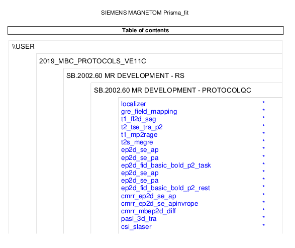

## Sample data

This tutorial makes use of a collection of MRI sessions
where data were acquired on a phantom
with intentional deviations from a baseline template session.
These data are publicly available,
and are additionally configured as a *submodule* of this `git` repository.

### Downloading the data

Obtain these data can be done in multiple ways:

1.  (*recommended*) Utilising the `git submodule` capability.

    This both places the data in the appropriate location
    for the example commands provided in the tutorial to execute without modification,
    and ensures version matching between the tutorial documentation
    and the data to which it refers.

    From the root of a clone of the ProtocolQC software, run:

    ```sh
    git submodule init
    git submodule update
    ```

    The data should now be stored in location `docs/tutorial/data/`.

2.  Manually clone the data repository.

    The tutorial data can be obtained using eg.:

    ```sh
    git clone git@github.com:Australian-Epilepsy-Project/ProtocolDeviations.git
    ```

    Note however that invocations of the ProtocolQC software
    following the tutorial material
    may need to be altered to reflect the relative filesystem locations
    of these data vs. protocol templates.

3.  Download an archive of the data

    If one is not comfortable with `git`,
    you could instead download an unzip the data from:
    https://github.com/Australian-Epilepsy-Project/ProtocolDeviations/archive/refs/heads/main.zip

### Inspect the datasets

To see a list of all image acquisition sessions provided in the dataset:

```sh
ls data/
```

Each session consists of a PDF document "`protocol.pdf`",
which is generated at the scanner console and shows all sequences executed and their full parameter listings,
and a directory that contains a set of DICOM series.

To see the full filesystem tree of the template session:

```sh
tree data/Template/
```

```
01_localizer
02_gre_field_mapping
03_t1_fl2d_sag
04_t2_tse_tra_p2
05_t1_mp2rage_INV1
06_t1_mp2rage_INV2
07_t1_mp2rage_T1_Images
08_t1_mp2rage_T1_Images_SIM-TI410ms
09_t1_mp2rage_T1_Images_SIM-TI1100ms
10_t1_mp2rage_UNI_Images
11_t1_mp2rage_UNI-DEN
12_t2s_megre
13_t2s_megre
14_t2s_megre
15_t2s_megre_R2Star_Images
16_ep2d_se_ap
17_ep2d_se_pa
18_ep2d_fid_basic_bold_p2_task
19_ep2d_se_ap
20_ep2d_se_pa
21_ep2d_fid_basic_bold_p2_rest
22_cmrr_ep2d_se_ap
23_cmrr_ep2d_se_apinvrope
24_cmrr_mbep2d_diff
25_cmrr_mbep2d_diff
26_cmrr_mbep2d_diff_ADC
27_cmrr_mbep2d_diff_TRACEW
28_cmrr_mbep2d_diff_FA
29_cmrr_mbep2d_diff_ColFA
30_cmrr_mbep2d_diff_TENSOR
31_pasl_3d_tra
32_pasl_3d_tra_Perfusion_Weighted
33_csi_slaser
34_Phoenix Document_PhoenixZIPReport
protocol.pdf
```

Comparing this filesystem listing
to the first page of the corresponding PDF document `data/Template/protocol.pdf`:



, it is hopefully clear that there is not perfect correspondence.
This is because for many MRI sequences,
a single execution of the sequence can yield multiple DICOM image series;
this could be magnitude and phase components of a complex image,
different variants of the image that have undergone different amounts of processing,
or generation of parametric maps by the scanner reconstruction.
