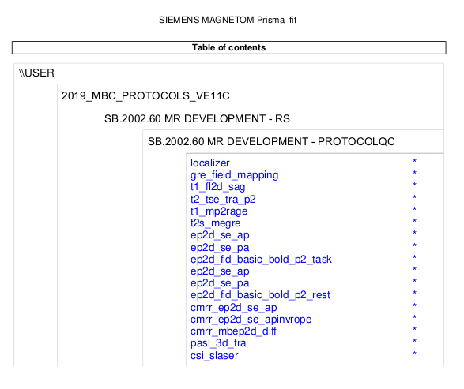

## Template 1: First working template

ProtocolQC uses JSON files to allow researchers to manually define
their expectations of how the session protocol should be executed,
including the nature and range of deviations that are deemed permissible.
This section of the tutorial will demonstrate how to generate an initial template,
which merely checks for the presence of all expected image series.

### "Acquisitions" vs. "Series"

The ProtocolQC software adopts nomenclature over and above that of the DICOM standard
to assist in both understanding of the relationships between image data
and how to construct a template accordingly.

In Magnetic Resonance Imaging,
it is quite common that,
upon clicking the "go" button to execute a specific sequence with a specific set of parameters,
upon completion of execution of that sequence the scanner platform will yield *more than one* images.
These images may be considered as discrete *image series* within DICOM
in circumstances where it is most appropriate to represent those images as discrete entities.
If however a session protocol involves multiple executions of many such sequences,
simply providing this as a list of individual series
fails to convey the intrinsic hierarchical structure of those image data:
some contain different image content reconstructed from the same execution of the same sequence,
others arise from execution of different sequences,
and merely happen to have been acquired during the same scanning session.

In the context of the ProtocolQC tool,
we define an "*acquisition*" as a single execution of a single imaging sequence program.
An "*acquisition*" takes some duration of time to execute,
and reconstruction and processing of the sampled data may result in the scanner hardware
emitting multiple discrete images as distinct DICOM series,
but those DICOM series are tightly related
in that the sequence executed,
the parameters provided to that sequence,
and the time during which the image data were sampled,
is precisely identical across that set of images.

To demonstrate this distinction,
consider the difference between the template protocol as printed by the scanner console,
and the set of DICOM series reconstructed from that protocol:



```sh
# Note: Reproducing this command call requires installation of the Xpdf package
pdftotext data/Template/protocol.pdf - -l 1 | \
    sed '/^\*$/d' | \
    sed '/^$/d' | \
    sed '/^\-1\-/d' | \
    tail -n+7
```

```text
localizer
gre_field_mapping
t1_fl2d_sag
t2_tse_tra_p2
t1_mp2rage
t2s_megre
ep2d_se_ap
ep2d_se_pa
ep2d_fid_basic_bold_p2_task
ep2d_se_ap
ep2d_se_pa
ep2d_fid_basic_bold_p2_rest
cmrr_ep2d_se_ap
cmrr_ep2d_se_apinvrope
cmrr_mbep2d_diff
pasl_3d_tra
csi_slaser
```

Every item in this list represents a single *acquisition*.
It is presented at the scanner console for configuration and execution,
and once executed takes some duration of time to acquire data.

Now contrast ths against the set of sub-directories containing the images generated from execution of the session protocol:

```sh
ls data/Template/
```

```text
01_localizer
02_gre_field_mapping
03_t1_fl2d_sag
04_t2_tse_tra_p2
05_t1_mp2rage_INV1
06_t1_mp2rage_INV2
07_t1_mp2rage_T1_Images
08_t1_mp2rage_T1_Images_SIM-TI410ms
09_t1_mp2rage_T1_Images_SIM-TI1100ms
10_t1_mp2rage_UNI_Images
11_t1_mp2rage_UNI-DEN
12_t2s_megre
13_t2s_megre
14_t2s_megre
15_t2s_megre_R2Star_Images
16_ep2d_se_ap
17_ep2d_se_pa
18_ep2d_fid_basic_bold_p2_task
19_ep2d_se_ap
20_ep2d_se_pa
21_ep2d_fid_basic_bold_p2_rest
22_cmrr_ep2d_se_ap
23_cmrr_ep2d_se_apinvrope
24_cmrr_mbep2d_diff
25_cmrr_mbep2d_diff
26_cmrr_mbep2d_diff_ADC
27_cmrr_mbep2d_diff_TRACEW
28_cmrr_mbep2d_diff_FA
29_cmrr_mbep2d_diff_ColFA
30_cmrr_mbep2d_diff_TENSOR
31_pasl_3d_tra
32_pasl_3d_tra_Perfusion_Weighted
33_csi_slaser
```

Each item in this list is a *DICOM series*.
For many of the sequences listed in the protocol PDF document,
there are multiple DICOM series here;
sometimes additional information is given within the series description
about the nature of the image content contained within,
other times this description is unchanged
and the directories are only disambiguated by the series number.
Regardless, the nomenclature that is utilised both within the ProtocolQC software and in this tutorial
is that each of these *acquisitions* may yield more than one *series*,
and the fact that multiple *series* were emitted by a single *acquisition*
is reflected in the hierarchical structure of the session templates
and the reporting generated by the software.

### Building the preliminary template

The ProtocolQC software provides some information about template construction
in the [software documentation](../building_a_template.md).
Here, those instructions are utilised to built the *simplest template possible*:
it will check for the presence of at least one image series
for which the value of the DICOM header field `SeriesDescription`
is identical to that shown in the scanner-generated session protocol document.

File [`templates/01_byseriesdescription.json`](templates/01_byseriesdescription.json)
contains a first working prototype template,
built exclusively from looking at the names of the directories
in which the DICOM series are stored.
It therefore *only* considers the logical groupings of these series into acquisitions,
and assumes that the naming of the sub-directories in which the individual series are stored
is reflected in DICOM header field `SeriesDescription`.

## First execution of the tool

The following execmplifies execution of the ProtocolQC tool
utilising a Docker container.
It assumes that the Docker image has already been built or pulled onto the local system,
with the name "`aep/protocolqc:latest`".

```sh
mkdir logs
docker run \
    -it \
    --rm \
    -v $(pwd)/data:/data \
    -v $(pwd)/templates:/templates \
    -v $(pwd)/logs:/logs \
    aep/protocolqc:latest \
    /data/Template \
    /templates/01_byseriesdescription.json \
    --logs_dir /logs
```

The tool produces the following at the terminal:

```text
INFO ------------------------------------------------------------------------------------------------------------------------------------------
INFO                                                        Summarising protocol matches
INFO ------------------------------------------------------------------------------------------------------------------------------------------
INFO  - 01_byseriesdescription.json: 0.93
INFO    - wrong number of duplicates for one or more acquisition templates
INFO    - 2 extra series were detected (unexpected)
INFO ------------------------------------------------------------------------------------------------------------------------------------------
INFO ------------------------------------------------------------------------------------------------------------------------------------------
ERROR No templates were matched. See above list and individual logs for details
INFO ------------------------------------------------------------------------------------------------------------------------------------------
```

What this terminal output means is that,
despite the fact that the template was built from the very same session that the validation is now being executed for,
there are nevertheless discordances detected.
These should not be interpreted as "this session having deviated from the planned protocol",
but rather that the ProtocolQC tool has *not yet been provided with adequately nuanced information about the template protocol*
to be capable of classifying the template session as confirming to that protocol.

More information about the nature of these mismatches
can be found in file `logs/01_byseriesdescription.json`:

```text
INFO -----------------------------------------------------------------------------------------------------------------------------------------------------
INFO                                                         Summary of series matches
INFO -----------------------------------------------------------------------------------------------------------------------------------------------------
INFO Template                                          | MatchStatus  | DataSeries                                                   | Score  | Complete
INFO -----------------------------------------------------------------------------------------------------------------------------------------------------
INFO Localizer:Image                                   | MATCH        | 1: localizer                                                 |   1.00 | True
INFO Dual echo gradient echo field map:PhaseDiff       | MATCH        | 2:gre_field_mapping                                          |   1.00 | True
INFO T1-weighted FLASH:Image                           | MATCH        | 3:t1_fl2d_sag                                                |   1.00 | True
INFO T2-weighted Turbo Spin Echo:Image                 | MATCH        | 4:t2_tse_tra_p2                                              |   1.00 | True
INFO MP2RAGE:First inversion                           | MATCH        | 5:t1_mp2rage_INV1                                            |   1.00 | True
INFO MP2RAGE:Second inversion                          | MATCH        | 6:t1_mp2rage_INV2                                            |   1.00 | True
INFO MP2RAGE:T1 map                                    | MATCH        | 7:t1_mp2rage_T1_Images                                       |   1.00 | True
INFO MP2RAGE:First simulated inversion time            | MATCH        | 8:t1_mp2rage_T1_Images_SIM-TI410ms                           |   1.00 | True
INFO MP2RAGE:Second simulated inversion time           | MATCH        | 9:t1_mp2rage_T1_Images_SIM-TI1100ms                          |   1.00 | True
INFO MP2RAGE:Uniform intensity image                   | MATCH        | 10:t1_mp2rage_UNI_Images                                     |   1.00 | True
INFO MP2RAGE:Denoised uniform intensity image          | MATCH        | 11:t1_mp2rage_UNI-DEN                                        |   1.00 | True
INFO T2*-weighted multi-echo gradient echo:Images      | DUPLICATES   | ---                                                          | ---    | ---
INFO                                                   |              | 12:t2s_megre                                                 |   1.00 | True
INFO                                                   |              | 13:t2s_megre                                                 |   1.00 | True
INFO                                                   |              | 14:t2s_megre                                                 |   1.00 | True
INFO T2*-weighted multi-echo gradient echo:R2* map     | NO MATCH     |                                                              |      0 |
INFO Spin-echo EPI (product); A>>P:Image               | DUPLICATES   | ---                                                          | ---    | ---
INFO                                                   |              | 16:ep2d_se_ap                                                |   1.00 | True
INFO                                                   |              | 19:ep2d_se_ap                                                |   1.00 | True
INFO Spin-echo EPI (product); P>>A:Image               | DUPLICATES   | ---                                                          | ---    | ---
INFO                                                   |              | 17:ep2d_se_pa                                                |   1.00 | True
INFO                                                   |              | 20:ep2d_se_pa                                                |   1.00 | True
INFO Task-based fMRI BOLD:Image                        | MATCH        | 18:ep2d_fid_basic_bold_p2_task                               |   1.00 | True
INFO Resting-state fMRI BOLD:Image                     | MATCH        | 21:ep2d_fid_basic_bold_p2_rest                               |   1.00 | True
INFO Spin-echo EPI (CMRR); A>>P:Image                  | MATCH        | 22:cmrr_ep2d_se_ap                                           |   1.00 | True
INFO Spin-echo EPI (CMRR); A>>P Inv-RO-PE:Image        | MATCH        | 23:cmrr_ep2d_se_apinvrope                                    |   1.00 | True
INFO Diffusion MRI:DWI                                 | DUPLICATES   | ---                                                          | ---    | ---
INFO                                                   |              | 24:cmrr_mbep2d_diff                                          |   1.00 | True
INFO                                                   |              | 25:cmrr_mbep2d_diff                                          |   1.00 | True
INFO Diffusion MRI:ADC                                 | MATCH        | 26:cmrr_mbep2d_diff_ADC                                      |   1.00 | True
INFO Diffusion MRI:Trace-weighted                      | MATCH        | 27:cmrr_mbep2d_diff_TRACEW                                   |   1.00 | True
INFO Diffusion MRI:Fractional Anisotropy               | MATCH        | 28:cmrr_mbep2d_diff_FA                                       |   1.00 | True
INFO Diffusion MRI:Directionally-Encoded Colour FA     | MATCH        | 29:cmrr_mbep2d_diff_ColFA                                    |   1.00 | True
INFO Diffusion MRI:Diffusion Tensor fit                | MATCH        | 30:cmrr_mbep2d_diff_TENSOR                                   |   1.00 | True
INFO Pulsed Arterial Spin Labelling:Images             | MATCH        | 31:pasl_3d_tra                                               |   1.00 | True
INFO Pulsed Arterial Spin Labelling:Perfusion-weighted | NO MATCH     |                                                              |      0 |
INFO Spectroscopy:Data                                 | MATCH        | 33:csi_slaser                                                |   1.00 | True
INFO Phoenix Report:Data                               | MATCH        | 99:PhoenixZIPReport                                          |   1.00 | True
INFO -----------------------------------------------------------------------------------------------------------------------------------------------------
WARNING                                                              UNMATCHED SERIES
INFO -----------------------------------------------------------------------------------------------------------------------------------------------------
WARNING 15:R2Star_Images
WARNING 32:Perfusion_Weighted
INFO ------------------------------------------------------------------------------------------------------------------------------------------
INFO                                                       Summary of acquisition matches
INFO ------------------------------------------------------------------------------------------------------------------------------------------
INFO Template                                 | MatchStatus                          | Score  | Complete
INFO ------------------------------------------------------------------------------------------------------------------------------------------
INFO Localizer                                | MATCH                                | 1.00   | True
INFO Dual echo gradient echo field map        | MATCH                                | 1.00   | True
INFO T1-weighted FLASH                        | MATCH                                | 1.00   | True
INFO T2-weighted Turbo Spin Echo              | MATCH                                | 1.00   | True
INFO MP2RAGE                                  | MATCH                                | 1.00   | True
INFO T2star-weighted multi-echo gradient echo | DUPLICATES (with PARTIAL DUPES)      | 0.00   | True
INFO Spin-echo EPI (product); A>>P            | DUPLICATES (UNEXPECTED)              | 1.00   | True
INFO Spin-echo EPI (product); P>>A            | DUPLICATES (UNEXPECTED)              | 1.00   | True
INFO Task-based fMRI BOLD                     | MATCH                                | 1.00   | True
INFO Resting-state fMRI BOLD                  | MATCH                                | 1.00   | True
INFO Spin-echo EPI (CMRR); A>>P               | MATCH                                | 1.00   | True
INFO Spin-echo EPI (CMRR); A>>P Inv-RO-PE     | MATCH                                | 1.00   | True
INFO Diffusion MRI                            | DUPLICATES (with PARTIAL DUPES)      | 0.00   | True
INFO Pulsed Arterial Spin Labelling           | PARTIAL                              | 0.50   | True
INFO Spectroscopy                             | MATCH                                | 1.00   | True
INFO Phoenix Report                           | MATCH                                | 1.00   | True
INFO ------------------------------------------------------------------------------------------------------------------------------------------
INFO Acquisition ordering correct: not checked
INFO No check for paired fmaps requested.
INFO ------------------------------------------------------------------------------------------------------------------------------------------
INFO
INFO ------------------------------------------------------------------------------------------------------------------------------------------
INFO ------------------------------------------------------------------------------------------------------------------------------------------
INFO Protocol match score 0.93 (fraction of acquisition matches)
INFO ------------------------------------------------------------------------------------------------------------------------------------------
```

These residual mismatches cannot be resolved
through exclusively use of field `SeriesDescription`;
further, there are good reasons why `SeriesDescription`
should *not* be used as the exclusive---or even primary--mechanism
of determining correspondence between an input dataset and the protocol template.
Read on to document [`02_seriesdescription.md`](02_seriesdescription.md)
to see the suggested revisions to this template.
