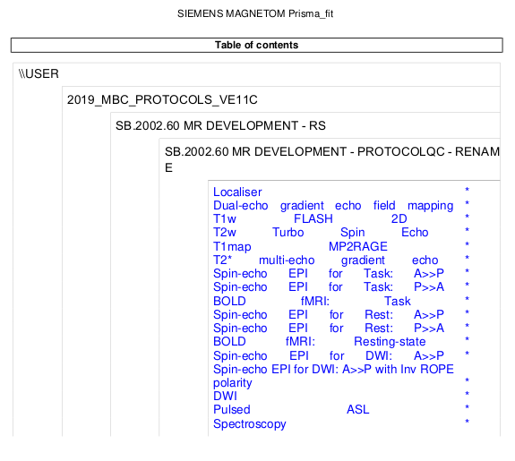

## Template 2: Reduced dependence on `SeriesDescription`

### Observations from outcomes of first working version

From the initial results of executing the software
showin in document [`01_firsttemplate.md`](01_firsttemplate.md),
there are several conclusions to be drawn
that will inform how the template should be initially modified.

#### Mismatch between sub-directory name and `SeriesDescription`

As soon as the DICOM data are sent from the scanner to a repository,
that repository is free to name and arrange the DICOM data as it sees fit.
This means that it is *not guaranteed* that there will be correspondence
between the name of a sub-directory in which the image data for a DICOM series is placed,
and the content of DICOM header field `SeriesDescription`.
The R2* parametric map from the T2*-weighted multi-echo gradient echo sequence
and the perfusion-weighted reconstruction from the pulsed Arterial Spin Labelling sequence
are two examples of this.
Template file [`template/01_byseriesdescription.json`](template/01_byseriesdescription.json)
assumed that these series would contain in their `SeriesDescription`
a *concatenation* of the `SeriesDescription` of the image data from which they were computed
and their respective strings describing what has been computed to produce that image series.
After all, this is how the data from other series in this session manifest.
This is however not the case:
the series within directory `*t2s_megre_R2Star_Images` in fact has a `SeriesDescription` of simply "`R2Star_Images`",
and the series within directory `*pasl_3d_tra_Perfusion_Weighted` has a `SeriesDescription` of "`Perfusion_Weighted`".
This means that for these two acquisitions,
it is *not possible* to group all of the DICOM series resulting from each of those acquisitions
based exclusively on the content of "`SeriesDescription`",
as there is no string that is common to both the reconstructed images and these computed derivatives.

#### Multiple series flagged as "duplicates"

For the following sequences:
-   "`t2s_megre`": T2*-weighted multi-echo gradient echo
-   "`cmrr_mbep2d_diff`": Diffusion MRI

, the software designates the presence of multiple DICOM image series as "duplicates";
that is, unexpected repeated executions of the sequence.
Interrogation of these data however exposes the fact that this is *not* what has happened.
Rather, those sequences have emitted multiple image series from a single execution;
specifically magnitude and phase components
(and indeed two separate magnitude images in the former case).
But specifically field "`SeriesDescription`" does not vary between those series.
Modification of `SeriesDescription` to reflect the emission of multiple distinct image series
is up to the particular version of the particular sequence program that is executed:
some sequences add "extra" information as suffixes to these strings,
others do not.
It is therefore necessary to augment the template provided to the ProtocolQC software
in such a way that it is able to suitably assign each of those image series
as being distinct series that all belong to the same acquisition.

#### Expected duplications flagged as unexpected

In this exemplar protocol,
there is a sequence pair that appears *twice* in the planned protocol.
This consists of a pair of spin-echo EPI images,
which are acquired with opposing phase encoding directions
prior to the execution of an fMRI time series.
These are intended for the estimation of susceptibility-induced geometric distortions,
such that correction for those distortions can be applied to that fMRI time series.
As is evident from the template protocol PDF printout,
the presence of two duplicates of this image pair is *planned*;
this reflects the fact that it is desired for these susceptibility field estimates
to correspond as closely as possible to the position of the subject
during acquisition of the fMRI data.
By default however,
the software assumes
(in the absence of any explicit data in the template to the contrary)
that each acquisition should appear only once.
The template therefore needs to be modified
to reflect the fact that *only* for these specific acquisitions,
there are specifically *two* acquisitions expected.

### Sensitivity to content of `SeriesDescription`

Over and above what has been described above
with respect to issues in classifying DICOM series based on the content of `SeriesDescription`,
it is broadly recommended to avoid utilising this field unless absolutely necessary.
While it is an appealing target to use for matching to a template
given that it is what is typically used to distinguish between series
when navigating the data in any other context,
it is *unreliable*.
Having the name of the acquisition modified at the scanner console
would not modify the sequence execution or conformity of the resulting data in any way,
and is exceptionally easy to do;
yet if ProtocolQC were to be instructed to match based on this field,
doing so would result in arguably erroneous reporting
that the received data completely violated the planned acquisition protocol.

Consider for instance session `Template_renaming`.

Here is the difference in the first page of the protocol PDF readouts
between session `Template/` and `Template_renaming/`:

 

```sh
# Note: Reproducing this command call requires installation of the Xpdf package
pdftotext data/Template/protocol.pdf - -l 1 | \
    sed '/^\*$/d' | \
    sed '/^$/d' | \
    sed '/^\-1\-/d' | \
    tail -n+7
```

```text
localizer
gre_field_mapping
t1_fl2d_sag
t2_tse_tra_p2
t1_mp2rage
t2s_megre
ep2d_se_ap
ep2d_se_pa
ep2d_fid_basic_bold_p2_task
ep2d_se_ap
ep2d_se_pa
ep2d_fid_basic_bold_p2_rest
cmrr_ep2d_se_ap
cmrr_ep2d_se_apinvrope
cmrr_mbep2d_diff
pasl_3d_tra
csi_slaser
```

```sh
# Note: Reproducing this command call requires installation of the Xpdf package
pdftotext data/Template_renaming/protocol.pdf - -l 1 -layout | \
    sed 's/  */ /g' | \
    sed 's/ \*//g' | \
    head -n-6 | \
    tail -n+14
```

```text
Localiser
Dual-echo gradient echo field mapping
T1w FLASH 2D
T2w Turbo Spin Echo
T1map MP2RAGE
T2* multi-echo gradient echo
Spin-echo EPI for Task: A>>P
Spin-echo EPI for Task: P>>A
BOLD fMRI: Task
Spin-echo EPI for Rest: A>>P
Spin-echo EPI for Rest: P>>A
BOLD fMRI: Resting-state
Spin-echo EPI for DWI: A>>P
Spin-echo EPI for DWI: A>>P with Inv ROPE polarity
DWI
Pulsed ASL
Spectroscopy
```

For this session,
the *only* thing that was changed
was the names of the sequences on the scanner console.
Yet, attempting to validate the data from this session
against the initial protocol template results in the following:

```text
INFO Comparing data to: 01_byseriesdescription.json
INFO ------------------------------------------------------------------------------------------------------------------------------------------
INFO                                                        Summarising protocol matches
INFO ------------------------------------------------------------------------------------------------------------------------------------------
INFO  - 01_byseriesdescription.json: 0.12
INFO    - one or more acquisition templates were unmatched
INFO    - 21 extra series were detected (unexpected)
INFO ------------------------------------------------------------------------------------------------------------------------------------------
```

While it might be tempting to accept this
as successful detection of deviation from the planned protocol,
the fact that the content of text string `SeriesDescription` has been modified
does *not* make the data incompatible with the purpose of their acquisition.
It is highly recommended
to instead perform template matching based on alternative,
more reliable DICOM metadata.
The only possible exception to this rule
is circumstances in which the feature of interest for a given sequence
is not explicitly encoded in any other metadata field;
a common example of this is the distinction between fMRI acquisitions
where the task performed by the subject differs between two or more acquisitions.

### The revised template

#### Examples of template changes

As a demonstrative example of how the operation of this revised template
functions in contrast to the first working example,
consider the T2*-weighted multi-echo gradient echo sequence.
In the first execution of the sequence above,
three of the four image series were erroneously flagged as duplicates,
and a fourth scanner-generated derivative was not matched to the template
due to the fact that the content of `SeriesDescription` is overwritten for those data.

Here is the corresponding section of the original template
([`templates/01_byseriesdescription.json`](templates/01_byseriesdescription.json)):

```json
  },
  "T2*-weighted multi-echo gradient echo": {
    "fields": {
      "SeriesDescription": {
        "value": "^t2s_megre.*",
        "comparison": "regex"
      }
    },
    "series": {
      "Images": {
        "fields": {
          "SeriesDescription": {
            "value": "t2s_megre",
            "comparison": "exact"
          }
        }
      },
      "R2* map": {
        "fields": {
          "SeriesDescription": {
            "value": ".*_R2Star_Images$",
            "comparison": "regex"
          }
        }
      }
    }
  },
```

And here is the corresponding section of the revised protocol
[`templates/02_bymetadata.json`](templates/02_bymetadata.json):

```json
  },
  "T2*-weighted multi-echo gradient echo": {
    "fields": {
      "Modality": {
        "value": "MR",
        "comparison": "exact"
      },
      "ScanningSequence": {
        "value": "GR",
        "comparison": "exact"
      },
      "SequenceVariant": {
        "value": [
          "SP",
          "OSP"
        ],
        "comparison": "exact"
      },
      "ScanOptions": {
        "value": "",
        "comparison": "exact"
      },
      "MRAcquisitionType": {
        "value": "3D",
        "comparison": "exact"
      },
      "SequenceName": {
        "value": "^\\*fl3d\\d+r",
        "comparison": "regex"
      }
    },
    "series": {
      "Magnitude (original)": {
        "fields": {
          "ImageType": {
            "value": [
              "ORIGINAL",
              "PRIMARY",
              "M",
              "ND"
            ],
            "comparison": "exact"
          }
        }
      },
      "Magnitude (normalised)": {
        "fields": {
          "ImageType": {
            "value": [
              "ORIGINAL",
              "PRIMARY",
              "M",
              "ND",
              "NORM"
            ],
            "comparison": "exact"
          }
        }
      },
      "Phase": {
        "fields": {
          "ImageType": {
            "value": [
              "ORIGINAL",
              "PRIMARY",
              "P",
              "ND"
            ],
            "comparison": "exact"
          }
        }
      },
      "R2* map": {
        "fields": {
          "ImageType": {
            "value": [
              "DERIVED",
              "PRIMARY",
              "R2_STAR MAP",
              "ND",
              "NORM"
            ],
            "comparison": "exact"
          }
        }
      }
    }
  },
```

-   Matching of the *acquisition* to the template is no longer done using `SeriesDescription`,
    which is trivially mutable at the scanner console,
    but instead with intrinsic attributes of the sequence.

-   Field `SequenceName` embeds within it the number of echoes.
    Rather than perform a "`exact`" comparison for that field here,
    which would enforce a match in both sequence name and number of echoes,
    here I chose to instead match the sequence name using a regex,
    which will technically match for a gradient echo sequence
    with any number of echoes;
    the number of echoes acquired will instead later be checked more explicitly
    using a metadata field that reports *exclusively* that parameter.

-   The distinct image series produced by this sequence within this acquisition
    are disambiguated through use of the `ImageType` field,
    which is the most common header field to utilise
    in classification of multiple series arising from a single acquisition.

#### Esoteric details of revised template

There are several nuances to the production of this revised template
that do not necessarily need to be comprehended by every single user,
but are documented here nevertheless for completeness:

-   The localiser and T1-weighted anatomical-contrast aacquisitions in the protocol template
    happen to use the same MR pulse sequence,
    and do not have any intrinsic parameters to distinguish them.
    With checking of a greater number of sequence parameters
    (explored later in this tutorial),
    it would become possible to distinguish between the two acquisitions in that way.
    In more typical MR session protocols,
    either these would be completely different sequences
    (eg. MPRAGE for high-resolution T1-weighted contrast;
    2D vs. 3D sequences),
    or there would be stronger distinctions in sequence parameters
    by which to disambiguate them.
    For the sake of this portion of the tutorial,
    these two are simply disambiguated by reading from `SeriesDescription`.

-   The string reported in field "`SequenceName`" is not,
    as one might intuitively expect,
    a unique identifier for a particular pulse sequence program.
    It is quite common for the *reported* sequence name
    to embed within it certain protocol parameters,
    such as 2D vs. 3D readout / number of echoes / acceleration factors.
    Here the revised protocol makes use of regular expressions
    to determine a high-level correspondence between template entries and input data;
    checking for matching of sequence parameters is deferred
    to later stages of this tutorial.

-   Some sequences, such as the diffusion MRI data here,
    export magnitude and phase data as distinct image series.
    Others intertwine magnitude and phase data,
    such as the MP2RAGE inversion images here.
    In the latter case,
    it is necessary for the template to match *all* DICOM files within that series;
    for instance using "`"comparison": "in_set"`".

-   The distinction between spin-echo EPI image series
    with opposite phase encoding directions
    is currently only performed based on the content of `SeriesDescription`.
    It would be preferable for the actual phase encoding direction
    that was applied by the scanner at the point of image acquisition
    to be verified against the expectations of the protocol.

-   The two simulated T1-weighted images produced by the MP2RAGE sequence
    can only be disambiguated by the content of `SeriesDescription`.
    Here the chosen solution is to define a single series template
    that is matched by both of these simulated images,
    and specify within the template that it is expected
    that there be two input image series matching this series template.

-   Two of the scanner-derived derivative series for the diffusion MRI acquisition,
    specifically the directionally-encoded colour FA image and tensor coefficient data,
    omit many metadata fields that are present in both the reconstructed image data
    and the other scanner-generated derivatives for that sequence.
    Here the chosen solution was to classify these input series as distinct acquisitions.
    It would have been equally valid to reduce the number of header fields
    that are used to define the acquisition,
    and duplicated the checks for those header fields within the individual image series.

#### Outcome of software with revised protocol

Terminal message:

```text
INFO ------------------------------------------------------------------------------------------------------------------------------------------
INFO                                                        Summarising protocol matches
INFO ------------------------------------------------------------------------------------------------------------------------------------------
INFO  - 02_bymetadata.json: 1.00
INFO    - wrong number of duplicates for one or more acquisition templates
INFO ------------------------------------------------------------------------------------------------------------------------------------------
INFO ------------------------------------------------------------------------------------------------------------------------------------------
ERROR No templates were perfectly matched; see above list and individual logs for details
INFO ------------------------------------------------------------------------------------------------------------------------------------------
```

Log file:

```text
INFO ------------------------------------------------------------------------------------------------------------------------------------------
INFO                                                         Summary of series matches
INFO ------------------------------------------------------------------------------------------------------------------------------------------
INFO Template                                                     | MatchStatus  | DataSeries                                 | Score  | Complete
INFO ------------------------------------------------------------------------------------------------------------------------------------------
INFO Localizer:Image                                              | MATCH        | 1:localizer                                |   1.00 | True
INFO Dual echo gradient echo field map:PhaseDiff                  | MATCH        | 2:gre_field_mapping                        |   1.00 | True
INFO T1-weighted FLASH:Image                                      | MATCH        | 3:t1_fl2d_sag                              |   1.00 | True
INFO T2-weighted Turbo Spin Echo:Image                            | MATCH        | 4:t2_tse_tra_p2                            |   1.00 | True
INFO MP2RAGE:First inversion                                      | MATCH        | 5:t1_mp2rage_INV1                          |   1.00 | True
INFO MP2RAGE:Second inversion                                     | MATCH        | 6:t1_mp2rage_INV2                          |   1.00 | True
INFO MP2RAGE:T1 map                                               | MATCH        | 7:t1_mp2rage_T1_Images                     |   1.00 | True
INFO MP2RAGE:Simulated inversion time                             | DUPLICATES   | ---                                        | ---    | ---
INFO                                                              |              | 8:t1_mp2rage_T1_Images_SIM-TI410ms         |   1.00 | True
INFO                                                              |              | 9:t1_mp2rage_T1_Images_SIM-TI1100ms        |   1.00 | True
INFO MP2RAGE:Uniform intensity image                              | MATCH        | 10:t1_mp2rage_UNI_Images                   |   1.00 | True
INFO MP2RAGE:Denoised uniform intensity image                     | MATCH        | 11:t1_mp2rage_UNI-DEN                      |   1.00 | True
INFO T2*-weighted multi-echo gradient echo:Magnitude (original)   | MATCH        | 12:t2s_megre                               |   1.00 | True
INFO T2*-weighted multi-echo gradient echo:Magnitude (normalised) | MATCH        | 13:t2s_megre                               |   1.00 | True
INFO T2*-weighted multi-echo gradient echo:Phase                  | MATCH        | 14:t2s_megre                               |   1.00 | True
INFO T2*-weighted multi-echo gradient echo:R2* map                | MATCH        | 15:R2Star_Images                           |   1.00 | True
INFO Spin-echo EPI (product); A>>P:Image                          | DUPLICATES   | ---                                        | ---    | ---
INFO                                                              |              | 16:ep2d_se_ap                              |   1.00 | True
INFO                                                              |              | 19:ep2d_se_ap                              |   1.00 | True
INFO Spin-echo EPI (product); P>>A:Image                          | DUPLICATES   | ---                                        | ---    | ---
INFO                                                              |              | 17:ep2d_se_pa                              |   1.00 | True
INFO                                                              |              | 20:ep2d_se_pa                              |   1.00 | True
INFO Task-based fMRI BOLD:Image                                   | MATCH        | 18:ep2d_fid_basic_bold_p2_task             |   1.00 | True
INFO Resting-state fMRI BOLD:Image                                | MATCH        | 21:ep2d_fid_basic_bold_p2_rest             |   1.00 | True
INFO Spin-echo EPI (CMRR); A>>P:Image                             | MATCH        | 22:cmrr_ep2d_se_ap                         |   1.00 | True
INFO Spin-echo EPI (CMRR); A>>P Inv-RO-PE:Image                   | MATCH        | 23:cmrr_ep2d_se_apinvrope                  |   1.00 | True
INFO Diffusion MRI:DWI magnitude                                  | MATCH        | 24:cmrr_mbep2d_diff                        |   1.00 | True
INFO Diffusion MRI:DWI phase                                      | MATCH        | 25:cmrr_mbep2d_diff                        |   1.00 | True
INFO Diffusion MRI:ADC                                            | MATCH        | 26:cmrr_mbep2d_diff_ADC                    |   1.00 | True
INFO Diffusion MRI:Trace-weighted                                 | MATCH        | 27:cmrr_mbep2d_diff_TRACEW                 |   1.00 | True
INFO Diffusion MRI:Fractional Anisotropy                          | MATCH        | 28:cmrr_mbep2d_diff_FA                     |   1.00 | True
INFO Directionally-Encoded Colour FA:Images                       | MATCH        | 29:cmrr_mbep2d_diff_ColFA                  |   1.00 | True
INFO Diffusion Tensor:Data                                        | MATCH        | 30:cmrr_mbep2d_diff_TENSOR                 |   1.00 | True
INFO Pulsed Arterial Spin Labelling:Images                        | MATCH        | 31:pasl_3d_tra                             |   1.00 | True
INFO Pulsed Arterial Spin Labelling:Perfusion-weighted            | MATCH        | 32:Perfusion_Weighted                      |   1.00 | True
INFO Spectroscopy:Data                                            | MATCH        | 33:csi_slaser                              |   1.00 | True
INFO Phoenix Report:Data                                          | MATCH        | 99:PhoenixZIPReport                        |   1.00 | True
INFO ------------------------------------------------------------------------------------------------------------------------------------------
INFO                                                       Summary of acquisition matches
INFO ------------------------------------------------------------------------------------------------------------------------------------------
INFO Template                                 | MatchStatus                          | Score  | Complete
INFO ------------------------------------------------------------------------------------------------------------------------------------------
INFO Localizer                                | MATCH                                | 1.00   | True
INFO Dual echo gradient echo field map        | MATCH                                | 1.00   | True
INFO T1-weighted FLASH                        | MATCH                                | 1.00   | True
INFO T2-weighted Turbo Spin Echo              | MATCH                                | 1.00   | True
INFO MP2RAGE                                  | DUPLICATES (with PARTIAL DUPES)      | 0.00   | True
INFO T2*-weighted multi-echo gradient echo    | MATCH                                | 1.00   | True
INFO Spin-echo EPI (product); A>>P            | DUPLICATES (EXPECTED)                | 1.00   | True
INFO Spin-echo EPI (product); P>>A            | DUPLICATES (EXPECTED)                | 1.00   | True
INFO Task-based fMRI BOLD                     | MATCH                                | 1.00   | True
INFO Resting-state fMRI BOLD                  | MATCH                                | 1.00   | True
INFO Spin-echo EPI (CMRR); A>>P               | MATCH                                | 1.00   | True
INFO Spin-echo EPI (CMRR); A>>P Inv-RO-PE     | MATCH                                | 1.00   | True
INFO Diffusion MRI                            | MATCH                                | 1.00   | True
INFO Directionally-Encoded Colour FA          | MATCH                                | 1.00   | True
INFO Diffusion Tensor                         | MATCH                                | 1.00   | True
INFO Pulsed Arterial Spin Labelling           | MATCH                                | 1.00   | True
INFO Spectroscopy                             | MATCH                                | 1.00   | True
INFO Phoenix Report                           | MATCH                                | 1.00   | True
INFO ------------------------------------------------------------------------------------------------------------------------------------------
INFO Acquisition ordering correct: not checked
INFO No check for paired fmaps requested.
INFO ------------------------------------------------------------------------------------------------------------------------------------------
INFO
INFO ------------------------------------------------------------------------------------------------------------------------------------------
INFO ------------------------------------------------------------------------------------------------------------------------------------------
INFO Protocol match score 1.00 (fraction of acquisition matches)
INFO ------------------------------------------------------------------------------------------------------------------------------------------
INFO Generating tags file...
INFO Tags file written to: /logs/patientID_25.07.22-10:57:33-STD-1.3.12.2.1107.5.2.43.167602_tags_02_bymetadata.json
```

While the maximal possible matching score of 1.00 is achieved,
the software reports an error due to an unexpected number of duplicates.
This is due to the way in which the two simulated T1-weighted images for the MP2RAGE sequence
are encoded in template [`templates/02_bymetadata.json`](templates/02_bymetadata.json).
To see how to better classify these two scanner-derivatived image series,
as well as how to check the *parameters* of each acquisition / series
over and above their presence,
go on to document [`03_checkparams.md`](03_checkparams.md).
