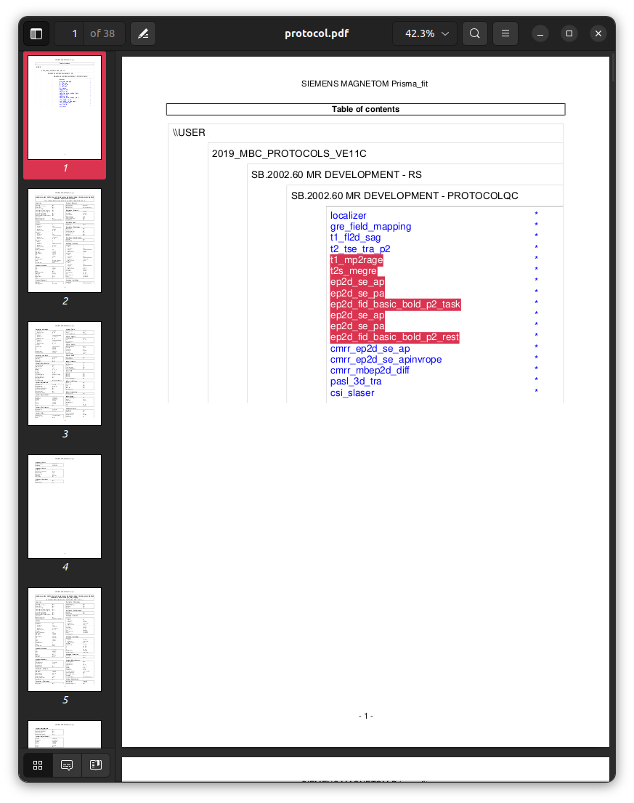
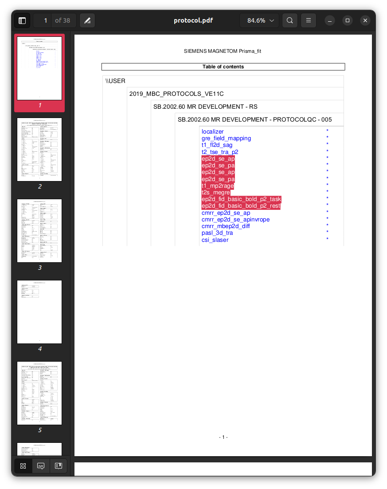

### Session `005`

```text
INFO Comparing data to: 03_checkparams.json
INFO ------------------------------------------------------------------------------------------------------------------------------------------
INFO                                                        Summarising protocol matches
INFO ------------------------------------------------------------------------------------------------------------------------------------------
INFO  - 03_checkparams.json: 1.00
INFO ------------------------------------------------------------------------------------------------------------------------------------------
```

The software fails to identify the fact that,
similarly to session `003` above,
there has been a change in the *order* of acquisitions.

Here is the template protocol:



```sh
pdftotext data/Template/protocol.pdf - -l 1 | \
    sed '/^\*$/d' | \
    sed '/^$/d' | \
    sed '/^\-1\-/d' | \
    tail -n+7
```

```
localizer
gre_field_mapping
t1_fl2d_sag
t2_tse_tra_p2
t1_mp2rage
t2s_megre
ep2d_se_ap
ep2d_se_pa
ep2d_fid_basic_bold_p2_task
ep2d_se_ap
ep2d_se_pa
ep2d_fid_basic_bold_p2_rest
cmrr_ep2d_se_ap
cmrr_ep2d_se_apinvrope
cmrr_mbep2d_diff
pasl_3d_tra
csi_slaser
```

And here is the same content from session `005`:



```sh
pdftotext data/005/protocol.pdf - -l 1 | \
    sed '/^\*$/d' | \
    sed '/^$/d' | \
    sed '/^\-1\-/d' | \
    tail -n+7
```

```
localizer
gre_field_mapping
t1_fl2d_sag
t2_tse_tra_p2
ep2d_se_ap
ep2d_se_pa
ep2d_se_ap
ep2d_se_pa
t1_mp2rage
t2s_megre
ep2d_fid_basic_bold_p2_task
ep2d_fid_basic_bold_p2_rest
cmrr_ep2d_se_ap
cmrr_ep2d_se_apinvrope
cmrr_mbep2d_diff
pasl_3d_tra
csi_slaser
```

Nomination within the `"GENERAL"` section of the protocol template
to enforce consistency in the order of acquisitions via `"check_ordering": true`,
as performed in response to the data from session `003`,
does not detect this discrepancy.
That particular mechanism is unable to detect relative movement
of the spin-echo EPI images within the protocol sequence
because it only enforces the execution of imaging sequences
with respect to the order in which acquisitions are defined in the protocol template,
and this does not work in the circumstance of repeated acquisitions.
Yet it is the scenario shown in this particular session
that is of the greatest consequence for protocol conformity:
spin-echo EPI acquisitions intended for field inhomogeneity estimation
should ideally be immediately before or after those acquisitions
for which that field is to be utilised for the correction of susceptibility distortions.

A second mechanism is provided within the ProtocolQC software
for enforcing desired temporal adjacency of acquisitions within session protocols.
For any given acquisition,
field `"paired_fmaps"` defines one or more sequences
that must appear immediately before or after the acquisition in question.
The template for the protocol in this tutorial
is modified as follows
(repeating for the resting-state fMRI acquisition also)

```json
  ...
  },
  "Task-based fMRI BOLD": {
    "paired_fmaps": {
      "which_acquisitions": [
        "Spin-echo EPI (product); A>>P",
        "Spin-echo EPI (product); P>>A"
      ],
      "position": "before"
    },
    "fields": {
      ...
```

In addition,
one would typically also specify `"ignore_ordering": true`
for the spin-echo EPI acquisitions,
since this mechanism effectively supersedes
and is more stringent than any global ordering:

```json
  ...
  },
  "Spin-echo EPI; A>>P": {
    "ignore_ordering": true,
    "fields": {
      ...
```

This results in the following:

```text
INFO Comparing data to: 04_additional.json
INFO ------------------------------------------------------------------------------------------------------------------------------------------
INFO                                                        Summarising protocol matches
INFO ------------------------------------------------------------------------------------------------------------------------------------------
INFO  - 04_additional.json: 1.00
INFO    - issue with one or more fmap pairings
INFO ------------------------------------------------------------------------------------------------------------------------------------------
```

```text
INFO ------------------------------------------------------------------------------------------------------------------------------------------
INFO Acquisition ordering correct: yes
INFO Checking for paired fmaps...
INFO Checking fmaps for: Task-based fMRI BOLD
ERROR Task-based fMRI BOLD missing paired fmap
INFO Checking fmaps for: Resting-state fMRI BOLD
ERROR Resting-state fMRI BOLD missing paired fmap
INFO ------------------------------------------------------------------------------------------------------------------------------------------
```
