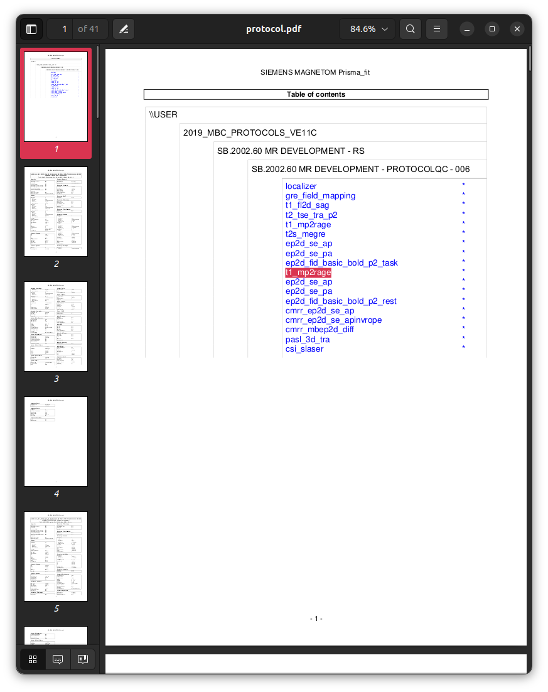

### Session `006`

```text
INFO Comparing data to: 03_checkparams.json
INFO ------------------------------------------------------------------------------------------------------------------------------------------
INFO                                                        Summarising protocol matches
INFO ------------------------------------------------------------------------------------------------------------------------------------------
INFO  - 03_checkparams.json: 1.00
INFO    - wrong number of duplicates for one or more acquisition templates
INFO ------------------------------------------------------------------------------------------------------------------------------------------
```

Here is the full tabular printout:

```text
INFO ------------------------------------------------------------------------------------------------------------------------------------------
INFO                                                         Summary of series matches
INFO ------------------------------------------------------------------------------------------------------------------------------------------
INFO Template                                                     | MatchStatus  | DataSeries                           | Score  | Complete
INFO ------------------------------------------------------------------------------------------------------------------------------------------
INFO Localizer:Image                                              | MATCH        | 1:localizer                          |   1.00 | True
INFO Dual echo gradient echo field map:PhaseDiff                  | MATCH        | 2:gre_field_mapping                  |   1.00 | True
INFO T1-weighted FLASH:Image                                      | MATCH        | 3:t1_fl2d_sag                        |   1.00 | True
INFO T2-weighted Turbo Spin Echo:Image                            | MATCH        | 4:t2_tse_tra_p2                      |   1.00 | True
INFO MP2RAGE:First inversion                                      | DUPLICATES   | ---                                  | ---    | ---
INFO                                                              |              | 5:t1_mp2rage_INV1                    |   1.00 | True
INFO                                                              |              | 19:t1_mp2rage_INV1                   |   1.00 | True
INFO MP2RAGE:Second inversion                                     | DUPLICATES   | ---                                  | ---    | ---
INFO                                                              |              | 6:t1_mp2rage_INV2                    |   1.00 | True
INFO                                                              |              | 20:t1_mp2rage_INV2                   |   1.00 | True
INFO MP2RAGE:T1 map                                               | DUPLICATES   | ---                                  | ---    | ---
INFO                                                              |              | 7:t1_mp2rage_T1_Images               |   1.00 | True
INFO                                                              |              | 21:t1_mp2rage_T1_Images              |   1.00 | True
INFO MP2RAGE:First simulated inversion time                       | DUPLICATES   | ---                                  | ---    | ---
INFO                                                              |              | 8:t1_mp2rage_T1_Images_SIM-TI410ms   |   1.00 | True
INFO                                                              |              | 22:t1_mp2rage_T1_Images_SIM-TI410ms  |   1.00 | True
INFO MP2RAGE:Second simulated inversion time                      | DUPLICATES   | ---                                  | ---    | ---
INFO                                                              |              | 9:t1_mp2rage_T1_Images_SIM-TI1100ms  |   1.00 | True
INFO                                                              |              | 23:t1_mp2rage_T1_Images_SIM-TI1100ms |   1.00 | True
INFO MP2RAGE:Uniform intensity image                              | DUPLICATES   | ---                                  | ---    | ---
INFO                                                              |              | 10:t1_mp2rage_UNI_Images             |   1.00 | True
INFO                                                              |              | 24:t1_mp2rage_UNI_Images             |   1.00 | True
INFO MP2RAGE:Denoised uniform intensity image                     | DUPLICATES   | ---                                  | ---    | ---
INFO                                                              |              | 11:t1_mp2rage_UNI-DEN                |   1.00 | True
INFO                                                              |              | 25:t1_mp2rage_UNI-DEN                |   1.00 | True
INFO T2*-weighted multi-echo gradient echo:Magnitude (original)   | MATCH        | 12:t2s_megre                         |   1.00 | True
INFO T2*-weighted multi-echo gradient echo:Magnitude (normalised) | MATCH        | 13:t2s_megre                         |   1.00 | True
INFO T2*-weighted multi-echo gradient echo:Phase                  | MATCH        | 14:t2s_megre                         |   1.00 | True
INFO T2*-weighted multi-echo gradient echo:R2* map                | MATCH        | 15:R2Star_Images                     |   1.00 | True
INFO Spin-echo EPI (product); A>>P:Image                          | DUPLICATES   | ---                                  | ---    | ---
INFO                                                              |              | 16:ep2d_se_ap                        |   1.00 | True
INFO                                                              |              | 26:ep2d_se_ap                        |   1.00 | True
INFO Spin-echo EPI (product); P>>A:Image                          | DUPLICATES   | ---                                  | ---    | ---
INFO                                                              |              | 17:ep2d_se_pa                        |   1.00 | True
INFO                                                              |              | 27:ep2d_se_pa                        |   1.00 | True
INFO Task-based fMRI BOLD:Image                                   | MATCH        | 18:ep2d_fid_basic_bold_p2_task       |   1.00 | True
INFO Resting-state fMRI BOLD:Image                                | MATCH        | 28:ep2d_fid_basic_bold_p2_rest       |   1.00 | True
INFO Spin-echo EPI (CMRR); A>>P:Image                             | MATCH        | 29:cmrr_ep2d_se_ap                   |   1.00 | True
INFO Spin-echo EPI (CMRR); A>>P Inv-RO-PE:Image                   | MATCH        | 30:cmrr_ep2d_se_apinvrope            |   1.00 | True
INFO Diffusion MRI:DWI magnitude                                  | MATCH        | 31:cmrr_mbep2d_diff                  |   1.00 | True
INFO Diffusion MRI:DWI phase                                      | MATCH        | 32:cmrr_mbep2d_diff                  |   1.00 | True
INFO Diffusion MRI:ADC                                            | MATCH        | 33:cmrr_mbep2d_diff_ADC              |   1.00 | True
INFO Diffusion MRI:Trace-weighted                                 | MATCH        | 34:cmrr_mbep2d_diff_TRACEW           |   1.00 | True
INFO Diffusion MRI:Fractional Anisotropy                          | MATCH        | 35:cmrr_mbep2d_diff_FA               |   1.00 | True
INFO Directionally-Encoded Colour FA:Images                       | MATCH        | 36:cmrr_mbep2d_diff_ColFA            |   1.00 | True
INFO Diffusion Tensor:Data                                        | MATCH        | 37:cmrr_mbep2d_diff_TENSOR           |   1.00 | True
INFO Pulsed Arterial Spin Labelling:Images                        | MATCH        | 38:pasl_3d_tra                       |   1.00 | True
INFO Pulsed Arterial Spin Labelling:Perfusion-weighted            | MATCH        | 39:Perfusion_Weighted                |   1.00 | True
INFO Spectroscopy:Data                                            | MATCH        | 40:csi_slaser                        |   1.00 | True
INFO Phoenix Report:Data                                          | MATCH        | 99:PhoenixZIPReport                  |   1.00 | True
INFO ------------------------------------------------------------------------------------------------------------------------------------------
INFO                                                       Summary of acquisition matches
INFO ------------------------------------------------------------------------------------------------------------------------------------------
INFO Template                                 | MatchStatus                          | Score  | Complete
INFO ------------------------------------------------------------------------------------------------------------------------------------------
INFO Localizer                                | MATCH                                | 1.00   | True
INFO Dual echo gradient echo field map        | MATCH                                | 1.00   | True
INFO T1-weighted FLASH                        | MATCH                                | 1.00   | True
INFO T2-weighted Turbo Spin Echo              | MATCH                                | 1.00   | True
INFO MP2RAGE                                  | DUPLICATES (UNEXPECTED)              | 1.00   | True
INFO T2*-weighted multi-echo gradient echo    | MATCH                                | 1.00   | True
INFO Spin-echo EPI (product); A>>P            | DUPLICATES (EXPECTED)                | 1.00   | True
INFO Spin-echo EPI (product); P>>A            | DUPLICATES (EXPECTED)                | 1.00   | True
INFO Task-based fMRI BOLD                     | MATCH                                | 1.00   | True
INFO Resting-state fMRI BOLD                  | MATCH                                | 1.00   | True
INFO Spin-echo EPI (CMRR); A>>P               | MATCH                                | 1.00   | True
INFO Spin-echo EPI (CMRR); A>>P Inv-RO-PE     | MATCH                                | 1.00   | True
INFO Diffusion MRI                            | MATCH                                | 1.00   | True
INFO Directionally-Encoded Colour FA          | MATCH                                | 1.00   | True
INFO Diffusion Tensor                         | MATCH                                | 1.00   | True
INFO Pulsed Arterial Spin Labelling           | MATCH                                | 1.00   | True
INFO Spectroscopy                             | MATCH                                | 1.00   | True
INFO Phoenix Report                           | MATCH                                | 1.00   | True
INFO ------------------------------------------------------------------------------------------------------------------------------------------
INFO Acquisition ordering correct: yes
INFO No check for paired fmaps requested.
INFO ------------------------------------------------------------------------------------------------------------------------------------------
```

Here the software reports unexpected duplicates of the image series
generated by the MP2RAGE sequence.
This conforms to the deviation that was applied during acquisition of this dataset,
which simulated *the re-acquisition of an individual sequence*,
perhaps due to excessive subject motion.

Here is the set of sequences planned for the protocol:


```sh
# Note: Reproducing this command call requires installation of the Xpdf package
pdftotext data/Template/protocol.pdf - -l 1 | \
    sed '/^\*$/d' | \
    sed '/^$/d' | \
    sed '/^\-1\-/d' | \
    tail -n+7
```

```
localizer
gre_field_mapping
t1_fl2d_sag
t2_tse_tra_p2
t1_mp2rage
t2s_megre
ep2d_se_ap
ep2d_se_pa
ep2d_fid_basic_bold_p2_task
ep2d_se_ap
ep2d_se_pa
ep2d_fid_basic_bold_p2_rest
cmrr_ep2d_se_ap
cmrr_ep2d_se_apinvrope
cmrr_mbep2d_diff
pasl_3d_tra
csi_slaser
```

And here is the corresponding printout from session `006`:



```sh
# Note: Reproducing this command call requires installation of the Xpdf package
pdftotext data/006/protocol.pdf - -l 1 | \
    sed '/^\*$/d' | \
    sed '/^$/d' | \
    sed '/^\-1\-/d' | \
    tail -n+7
```

```
localizer
gre_field_mapping
t1_fl2d_sag
t2_tse_tra_p2
t1_mp2rage
t2s_megre
ep2d_se_ap
ep2d_se_pa
ep2d_fid_basic_bold_p2_task
t1_mp2rage
ep2d_se_ap
ep2d_se_pa
ep2d_fid_basic_bold_p2_rest
cmrr_ep2d_se_ap
cmrr_ep2d_se_apinvrope
cmrr_mbep2d_diff
pasl_3d_tra
csi_slaser
```

Note how the MP2RAGE sequence was executed in its usual location,
in between the T2-weighted Turbo Spin Echo sequence
and the T2*-weighted multi-echo gradient echo sequence,
but was then executed a second time
between the two BOLD fMRI sequences.

How to respond to the presence / prospect of such duplicates
is left up to the individual responsible for curating the data.
For instance:
-   Manual inspection of the respective image series
    to determine if only one should proceed through an analysis pipeline
-   Explicitly specifying in the protocol template
    whether duplicates of any given series / acquisition
    should be flagged as potentially erroneous by the ProtocolQC software.
    This can be achieved using:

    ```json
      },
      "Acquisition": {
        "duplicates_allowed": true,
        "fields": {
    ```
