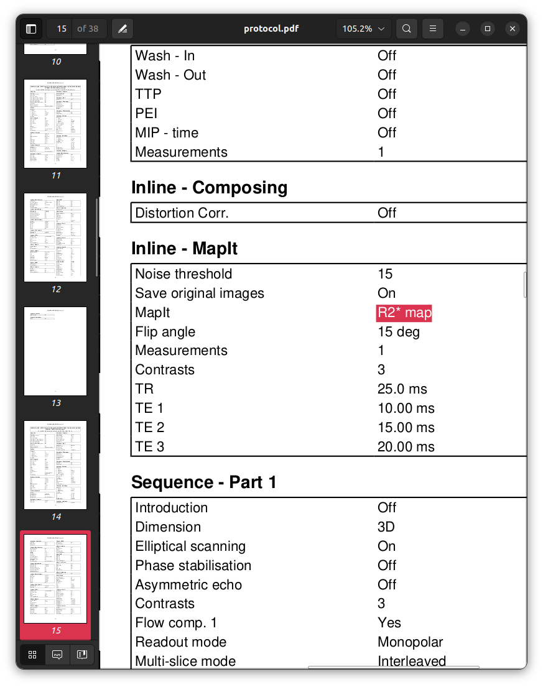

### Session 007

```text
INFO Comparing data to: 03_checkparams.json
INFO ------------------------------------------------------------------------------------------------------------------------------------------
INFO                                                        Summarising protocol matches
INFO ------------------------------------------------------------------------------------------------------------------------------------------
INFO  - 03_checkparams.json: 0.94
INFO    - one or more acquisition templates were unmatched
INFO ------------------------------------------------------------------------------------------------------------------------------------------
```

Contents of log file:

```text
INFO ------------------------------------------------------------------------------------------------------------------------------------------
INFO                                                         Summary of series matches
INFO ------------------------------------------------------------------------------------------------------------------------------------------
INFO Template                                                     | MatchStatus  | DataSeries                          | Score  | Complete
INFO ------------------------------------------------------------------------------------------------------------------------------------------
INFO Localizer:Image                                              | MATCH        | 1:localizer                         |   1.00 | True
INFO Dual echo gradient echo field map:PhaseDiff                  | MATCH        | 2:gre_field_mapping                 |   1.00 | True
INFO T1-weighted FLASH:Image                                      | MATCH        | 3:t1_fl2d_sag                       |   1.00 | True
INFO T2-weighted Turbo Spin Echo:Image                            | MATCH        | 4:t2_tse_tra_p2                     |   1.00 | True
INFO MP2RAGE:First inversion                                      | MATCH        | 5:t1_mp2rage_INV1                   |   1.00 | True
INFO MP2RAGE:Second inversion                                     | MATCH        | 6:t1_mp2rage_INV2                   |   1.00 | True
INFO MP2RAGE:T1 map                                               | MATCH        | 7:t1_mp2rage_T1_Images              |   1.00 | True
INFO MP2RAGE:First simulated inversion time                       | MATCH        | 8:t1_mp2rage_T1_Images_SIM-TI410ms  |   1.00 | True
INFO MP2RAGE:Second simulated inversion time                      | MATCH        | 9:t1_mp2rage_T1_Images_SIM-TI1100ms |   1.00 | True
INFO MP2RAGE:Uniform intensity image                              | MATCH        | 10:t1_mp2rage_UNI_Images            |   1.00 | True
INFO MP2RAGE:Denoised uniform intensity image                     | MATCH        | 11:t1_mp2rage_UNI-DEN               |   1.00 | True
INFO T2*-weighted multi-echo gradient echo:Magnitude (original)   | MATCH        | 12:t2s_megre                        |   1.00 | True
INFO T2*-weighted multi-echo gradient echo:Magnitude (normalised) | MATCH        | 13:t2s_megre                        |   1.00 | True
INFO T2*-weighted multi-echo gradient echo:Phase                  | MATCH        | 14:t2s_megre                        |   1.00 | True
INFO T2*-weighted multi-echo gradient echo:R2* map                | PART. DUPES  | ---                                 | ---    | ---
INFO                                                              |              | 12:t2s_megre                        |   0.97 | True
INFO                                                              |              | 13:t2s_megre                        |   0.97 | True
INFO                                                              |              | 14:t2s_megre                        |   0.97 | True
INFO Spin-echo EPI (product); A>>P:Image                          | DUPLICATES   | ---                                 | ---    | ---
INFO                                                              |              | 15:ep2d_se_ap                       |   1.00 | True
INFO                                                              |              | 18:ep2d_se_ap                       |   1.00 | True
INFO Spin-echo EPI (product); P>>A:Image                          | DUPLICATES   | ---                                 | ---    | ---
INFO                                                              |              | 16:ep2d_se_pa                       |   1.00 | True
INFO                                                              |              | 19:ep2d_se_pa                       |   1.00 | True
INFO Task-based fMRI BOLD:Image                                   | MATCH        | 17:ep2d_fid_basic_bold_p2_task      |   1.00 | True
INFO Resting-state fMRI BOLD:Image                                | MATCH        | 20:ep2d_fid_basic_bold_p2_rest      |   1.00 | True
INFO Spin-echo EPI (CMRR); A>>P:Image                             | MATCH        | 21:cmrr_ep2d_se_ap                  |   1.00 | True
INFO Spin-echo EPI (CMRR); A>>P Inv-RO-PE:Image                   | MATCH        | 22:cmrr_ep2d_se_apinvrope           |   1.00 | True
INFO Diffusion MRI:DWI magnitude                                  | MATCH        | 23:cmrr_mbep2d_diff                 |   1.00 | True
INFO Diffusion MRI:DWI phase                                      | MATCH        | 24:cmrr_mbep2d_diff                 |   1.00 | True
INFO Diffusion MRI:ADC                                            | MATCH        | 25:cmrr_mbep2d_diff_ADC             |   1.00 | True
INFO Diffusion MRI:Trace-weighted                                 | MATCH        | 26:cmrr_mbep2d_diff_TRACEW          |   1.00 | True
INFO Diffusion MRI:Fractional Anisotropy                          | MATCH        | 27:cmrr_mbep2d_diff_FA              |   1.00 | True
INFO Directionally-Encoded Colour FA:Images                       | MATCH        | 28:cmrr_mbep2d_diff_ColFA           |   1.00 | True
INFO Diffusion Tensor:Data                                        | MATCH        | 29:cmrr_mbep2d_diff_TENSOR          |   1.00 | True
INFO Pulsed Arterial Spin Labelling:Images                        | MATCH        | 30:pasl_3d_tra                      |   1.00 | True
INFO Pulsed Arterial Spin Labelling:Perfusion-weighted            | MATCH        | 31:Perfusion_Weighted               |   1.00 | True
INFO Spectroscopy:Data                                            | MATCH        | 32:csi_slaser                       |   1.00 | True
INFO Phoenix Report:Data                                          | MATCH        | 99:PhoenixZIPReport                 |   1.00 | True
INFO ------------------------------------------------------------------------------------------------------------------------------------------
INFO                                                       Summary of acquisition matches
INFO ------------------------------------------------------------------------------------------------------------------------------------------
INFO Template                                 | MatchStatus                          | Score  | Complete
INFO ------------------------------------------------------------------------------------------------------------------------------------------
INFO Localizer                                | MATCH                                | 1.00   | True
INFO Dual echo gradient echo field map        | MATCH                                | 1.00   | True
INFO T1-weighted FLASH                        | MATCH                                | 1.00   | True
INFO T2-weighted Turbo Spin Echo              | MATCH                                | 1.00   | True
INFO MP2RAGE                                  | MATCH                                | 1.00   | True
INFO T2*-weighted multi-echo gradient echo    | NOMATCH                              | 0.00   | True
INFO Spin-echo EPI (product); A>>P            | DUPLICATES (EXPECTED)                | 1.00   | True
INFO Spin-echo EPI (product); P>>A            | DUPLICATES (EXPECTED)                | 1.00   | True
INFO Task-based fMRI BOLD                     | MATCH                                | 1.00   | True
INFO Resting-state fMRI BOLD                  | MATCH                                | 1.00   | True
INFO Spin-echo EPI (CMRR); A>>P               | MATCH                                | 1.00   | True
INFO Spin-echo EPI (CMRR); A>>P Inv-RO-PE     | MATCH                                | 1.00   | True
INFO Diffusion MRI                            | MATCH                                | 1.00   | True
INFO Directionally-Encoded Colour FA          | MATCH                                | 1.00   | True
INFO Diffusion Tensor                         | MATCH                                | 1.00   | True
INFO Pulsed Arterial Spin Labelling           | MATCH                                | 1.00   | True
INFO Spectroscopy                             | MATCH                                | 1.00   | True
INFO Phoenix Report                           | MATCH                                | 1.00   | True
INFO ------------------------------------------------------------------------------------------------------------------------------------------
INFO Acquisition ordering correct: not checked
INFO No check for paired fmaps requested.
INFO ------------------------------------------------------------------------------------------------------------------------------------------
```

The softwares fails to comprehensively match
the T2*-weighted multi-echo gradient sequence.
While the first three image series for that acquisition are matched without issue,
the fourth only achieves partial matches to input series.

Interpretation of this result requires a little nuance.
For the quantitative R2* parametric map
that should be generated by the scanner from these image data,
there are three reported partial matches.
The `SeriesDescription` of each of these does not provide detail
over and above being associated with the same acquisition.
Checking the `SeriesNumber` of each of these
reveals that what the software is actually reporting
is the fact that the three reconstructed image series for this acquisition,
being original magnitude / normalised magnitude / phase,
are not quite perfect matches to the R2* map image series template.
This makes sense given that none of these observed image series
contain the metadata expected for specifically the R2* image series.
The way that this information should be interpreted therefore,
which is in concordance with the modification performed during image acquisition,
is that *the scanner-generated derivative R2** *map is missing from the input dataset*.

Here is the relevant content of the template protocol PDF printout:




```sh
pdftotext data/Template/protocol.pdf - -f 14 -l 16 -layout | \
    grep "MapIt" | \
    tail -n1 | \
    sed 's/  */ /g' | \
    rev | \
    cut -d' ' -f1-3 | \
    rev
```

`MapIt R2* Map`

Whereas for session `007`:


```sh
pdftotext data/007/protocol.pdf - -f 14 -l 16 -layout | \
    grep "MapIt" | \
    tail -n1 | \
    sed 's/  */ /g' | \
    rev | \
    cut -d' ' -f1-2 | \
    rev
```

`MapIt None`
