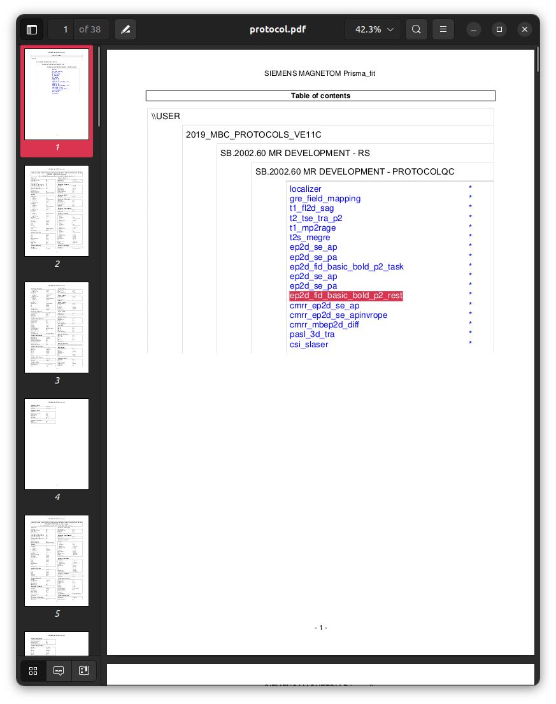
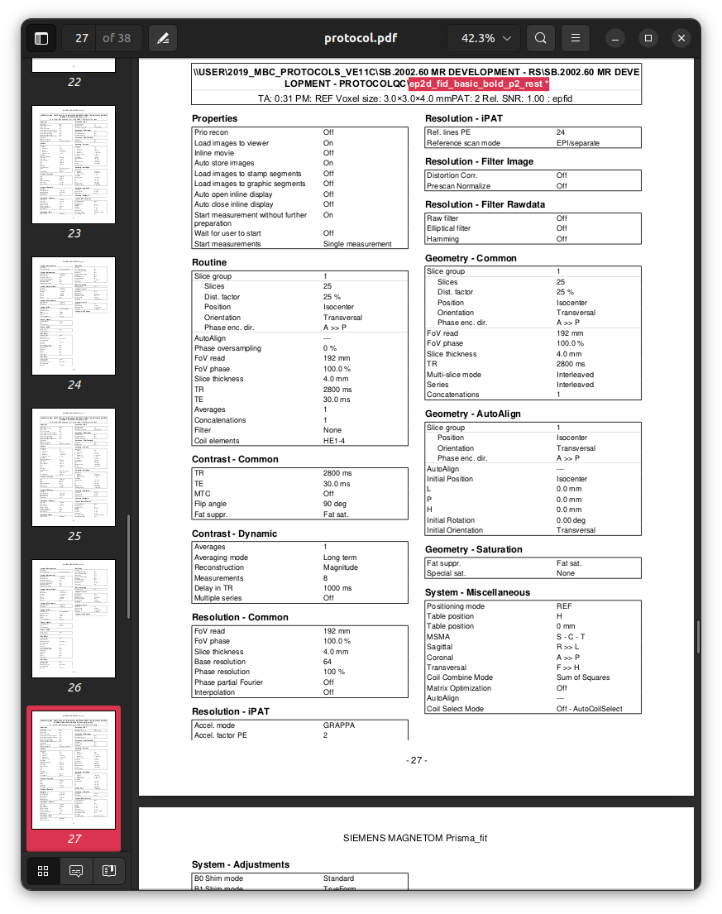
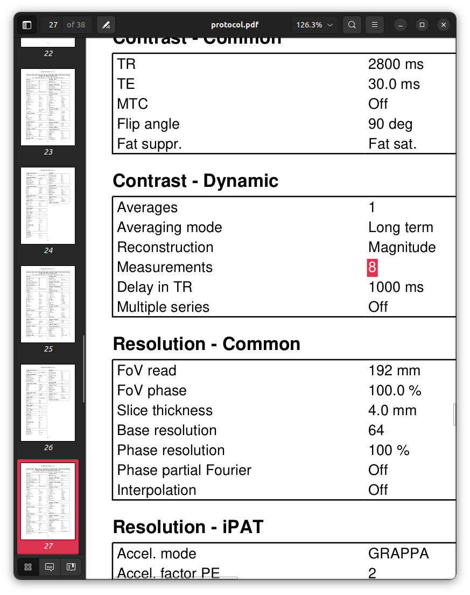
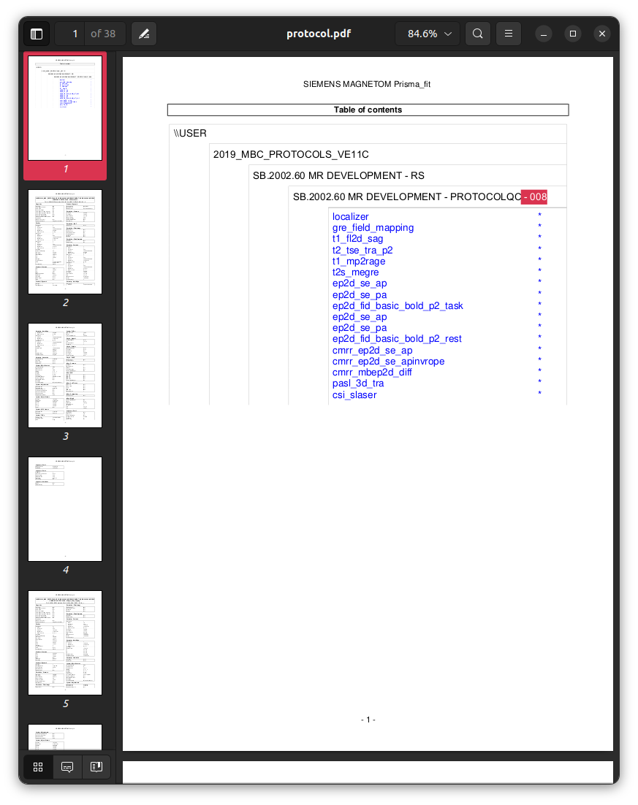
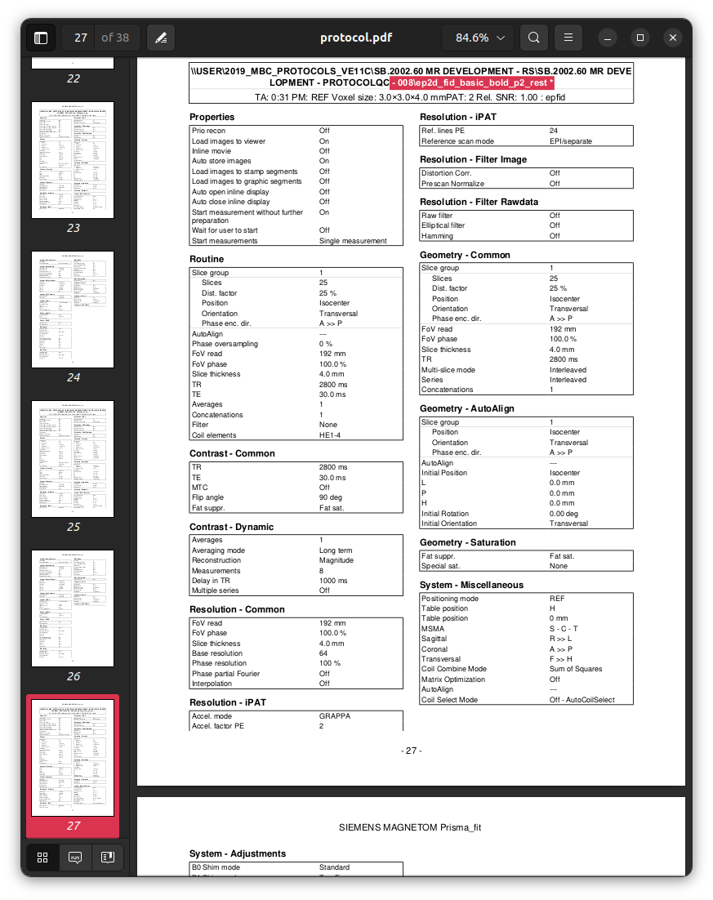
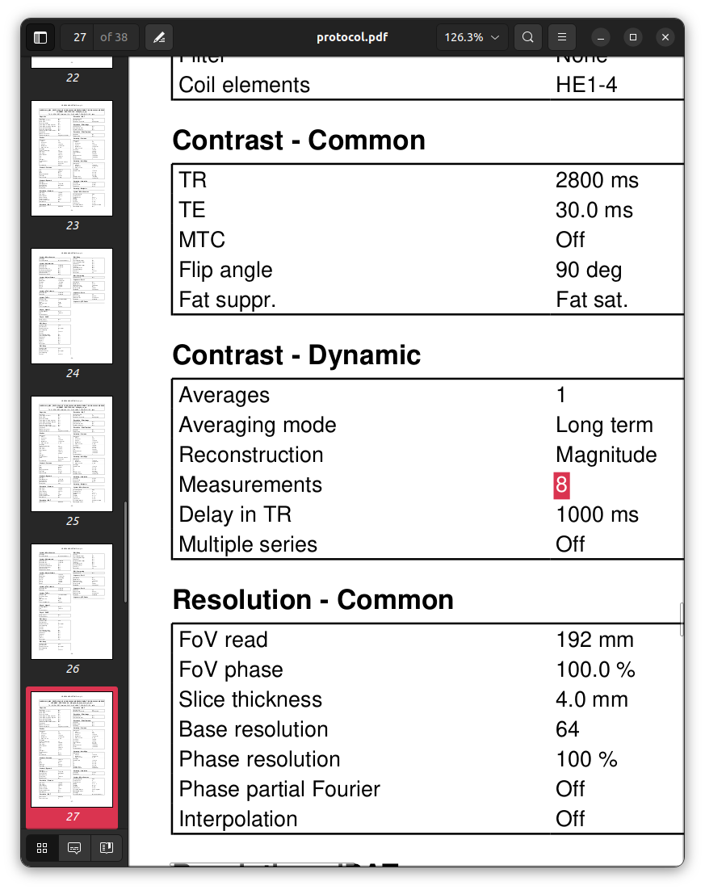

### Session `008`

```text
INFO ------------------------------------------------------------------------------------------------------------------------------------------
INFO                                                        Summarising protocol matches
INFO ------------------------------------------------------------------------------------------------------------------------------------------
INFO  - 03_checkparams.json: 1.00
INFO ------------------------------------------------------------------------------------------------------------------------------------------
```

In this initial test, the software does not identify any issue with this dataset.

Consulting with the written notes taken during acquisition of this session,
it is stated that the resting-state BOLD fMRI session was *terminated prematurely*.
The software is however currently failing to identify this,
as this premature termination has not resulted in any discordance
between the *DICOM metadata* and the protocol template.
The difference is however visible within the filesystem contents:

```sh
ls data/Template/21_ep2d_fid_basic_bold_p2_rest/dicom_series/ | \
    wc -l
```

`200`

```sh
ls data/Template/21_ep2d_fid_basic_bold_p2_rest/dicom_series/ | \
    wc -l
```

`125`

Testing for *completeness* of a dataset can be achieved
by encoding within the protocol template
the *number of files* expected for each image series:

```json
  ...
  },
  "Acquisition": {
    "fields": {
      ...
    },
    "series": {
      "Series": {
        "num_files": 25,
        "fields": {
          ...
        }
      }
    }
  },
  ...
```

**NOTE**: Check `num_files` difference between INV1 and INV2

Note that `"num_files"` can *only* be defined specifically for a *series*,
*not* for acquisitions or sessions.

Running this dataset against the updated template
produces the following error at the terminal:

```text
INFO Comparing data to: 04_additional.json
INFO ------------------------------------------------------------------------------------------------------------------------------------------
INFO                                                        Summarising protocol matches
INFO ------------------------------------------------------------------------------------------------------------------------------------------
INFO  - 04_additional.json: 1.00 (MISSING DATA)
INFO ------------------------------------------------------------------------------------------------------------------------------------------
INFO ------------------------------------------------------------------------------------------------------------------------------------------
ERROR No templates were perfectly matched; see above list and individual logs for details
INFO ------------------------------------------------------------------------------------------------------------------------------------------
```

WIth the following produced within the log file:

```text
INFO ------------------------------------------------------------------------------------------------------------------------------------------
INFO                                                         Summary of series matches
INFO ------------------------------------------------------------------------------------------------------------------------------------------
INFO Template                                                     | MatchStatus  | DataSeries                          | Score  | Complete
INFO ------------------------------------------------------------------------------------------------------------------------------------------
INFO Localizer:Image                                              | MATCH        | 1:localizer                         |   1.00 | True
INFO Dual echo gradient echo field map:PhaseDiff                  | MATCH        | 2:gre_field_mapping                 |   1.00 | True
INFO T1-weighted FLASH:Image                                      | MATCH        | 3:t1_fl2d_sag                       |   1.00 | True
INFO T2-weighted Turbo Spin Echo:Image                            | MATCH        | 4:t2_tse_tra_p2                     |   1.00 | True
INFO MP2RAGE:First inversion                                      | MATCH        | 5:t1_mp2rage_INV1                   |   1.00 | True
INFO MP2RAGE:Second inversion                                     | MATCH        | 6:t1_mp2rage_INV2                   |   1.00 | True
INFO MP2RAGE:T1 map                                               | MATCH        | 7:t1_mp2rage_T1_Images              |   1.00 | True
INFO MP2RAGE:First simulated inversion time                       | MATCH        | 8:t1_mp2rage_T1_Images_SIM-TI410ms  |   1.00 | True
INFO MP2RAGE:Second simulated inversion time                      | MATCH        | 9:t1_mp2rage_T1_Images_SIM-TI1100ms |   1.00 | True
INFO MP2RAGE:Uniform intensity image                              | MATCH        | 10:t1_mp2rage_UNI_Images            |   1.00 | True
INFO MP2RAGE:Denoised uniform intensity image                     | MATCH        | 11:t1_mp2rage_UNI-DEN               |   1.00 | True
INFO T2*-weighted multi-echo gradient echo:Magnitude (original)   | MATCH        | 12:t2s_megre                        |   1.00 | True
INFO T2*-weighted multi-echo gradient echo:Magnitude (normalised) | MATCH        | 13:t2s_megre                        |   1.00 | True
INFO T2*-weighted multi-echo gradient echo:Phase                  | MATCH        | 14:t2s_megre                        |   1.00 | True
INFO T2*-weighted multi-echo gradient echo:R2* map                | MATCH        | 15:R2Star_Images                    |   1.00 | True
INFO Spin-echo EPI (product); A>>P:Image                          | DUPLICATES   | ---                                 | ---    | ---
INFO                                                              |              | 16:ep2d_se_ap                       |   1.00 | True
INFO                                                              |              | 19:ep2d_se_ap                       |   1.00 | True
INFO Spin-echo EPI (product); P>>A:Image                          | DUPLICATES   | ---                                 | ---    | ---
INFO                                                              |              | 17:ep2d_se_pa                       |   1.00 | True
INFO                                                              |              | 20:ep2d_se_pa                       |   1.00 | True
INFO Task-based fMRI BOLD:Image                                   | MATCH        | 18:ep2d_fid_basic_bold_p2_task      |   1.00 | True
INFO Resting-state fMRI BOLD:Image                                | MATCH        | 21:ep2d_fid_basic_bold_p2_rest      |   1.00 | False
INFO Spin-echo EPI (CMRR); A>>P:Image                             | MATCH        | 22:cmrr_ep2d_se_ap                  |   1.00 | True
INFO Spin-echo EPI (CMRR); A>>P Inv-RO-PE:Image                   | MATCH        | 23:cmrr_ep2d_se_apinvrope           |   1.00 | True
INFO Diffusion MRI:DWI magnitude                                  | MATCH        | 24:cmrr_mbep2d_diff                 |   1.00 | True
INFO Diffusion MRI:DWI phase                                      | MATCH        | 25:cmrr_mbep2d_diff                 |   1.00 | True
INFO Diffusion MRI:ADC                                            | MATCH        | 26:cmrr_mbep2d_diff_ADC             |   1.00 | True
INFO Diffusion MRI:Trace-weighted                                 | MATCH        | 27:cmrr_mbep2d_diff_TRACEW          |   1.00 | True
INFO Diffusion MRI:Fractional Anisotropy                          | MATCH        | 28:cmrr_mbep2d_diff_FA              |   1.00 | True
INFO Directionally-Encoded Colour FA:Images                       | MATCH        | 29:cmrr_mbep2d_diff_ColFA           |   1.00 | True
INFO Diffusion Tensor:Data                                        | MATCH        | 30:cmrr_mbep2d_diff_TENSOR          |   1.00 | True
INFO Pulsed Arterial Spin Labelling:Images                        | MATCH        | 31:pasl_3d_tra                      |   1.00 | True
INFO Pulsed Arterial Spin Labelling:Perfusion-weighted            | MATCH        | 32:Perfusion_Weighted               |   1.00 | True
INFO Spectroscopy:Data                                            | MATCH        | 33:csi_slaser                       |   1.00 | True
INFO Phoenix Report:Data                                          | MATCH        | 99:PhoenixZIPReport                 |   1.00 | True
INFO ------------------------------------------------------------------------------------------------------------------------------------------
INFO                                                       Summary of acquisition matches
INFO ------------------------------------------------------------------------------------------------------------------------------------------
INFO Template                                 | MatchStatus                          | Score  | Complete
INFO ------------------------------------------------------------------------------------------------------------------------------------------
INFO Localizer                                | MATCH                                | 1.00   | True
INFO Dual echo gradient echo field map        | MATCH                                | 1.00   | True
INFO T1-weighted FLASH                        | MATCH                                | 1.00   | True
INFO T2-weighted Turbo Spin Echo              | MATCH                                | 1.00   | True
INFO MP2RAGE                                  | MATCH                                | 1.00   | True
INFO T2*-weighted multi-echo gradient echo    | MATCH                                | 1.00   | True
INFO Spin-echo EPI (product); A>>P            | DUPLICATES (EXPECTED)                | 1.00   | True
INFO Spin-echo EPI (product); P>>A            | DUPLICATES (EXPECTED)                | 1.00   | True
INFO Task-based fMRI BOLD                     | MATCH                                | 1.00   | True
INFO Resting-state fMRI BOLD                  | MATCH                                | 1.00   | False
INFO Spin-echo EPI (CMRR); A>>P               | MATCH                                | 1.00   | True
INFO Spin-echo EPI (CMRR); A>>P Inv-RO-PE     | MATCH                                | 1.00   | True
INFO Diffusion MRI                            | MATCH                                | 1.00   | True
INFO Directionally-Encoded Colour FA          | MATCH                                | 1.00   | True
INFO Diffusion Tensor                         | MATCH                                | 1.00   | True
INFO Pulsed Arterial Spin Labelling           | MATCH                                | 1.00   | True
INFO Spectroscopy                             | MATCH                                | 1.00   | True
INFO Phoenix Report                           | MATCH                                | 1.00   | True
INFO ------------------------------------------------------------------------------------------------------------------------------------------
INFO Acquisition ordering correct: yes
INFO No check for paired fmaps requested.
INFO ------------------------------------------------------------------------------------------------------------------------------------------
```

Note in particular in the second table,
the designation of `Complete: False` for the resting-state fMRI BOLD data.
This can be seen in the filesystem contents:

```sh
ls data/Template/21_ep2d_fid_basic_bold_p2_rest/dicom_series | \
    tail -n5
```

```
0196.dcm
0197.dcm
0198.dcm
0199.dcm
0200.dcm
```

```sh
ls data/008/21_ep2d_fid_basic_bold_p2_rest/dicom_series | \
    tail -n5
```

```
0121.dcm
0122.dcm
0123.dcm
0124.dcm
0125.dcm
```

Note that this discrepancy is *not* visible in the protocol PDF printouts,
as they encode the protocol *plan*,
*not* what was actually acquired!

Here is the template protocol:







```sh
pdftotext data/Template/protocol.pdf - -f 27 -l 28 -layout | \
    grep "Measurements" | \
    head -n1 | \
    sed 's/  */ /g'
```

`Measurements 8`

And here is the printout from session `008`:







```sh
pdftotext data/008/protocol.pdf - -f 27 -l 28 -layout | \
    grep "Measurements" | \
    head -n1 | \
    sed 's/  */ /g'
```

`Measurements 8`
