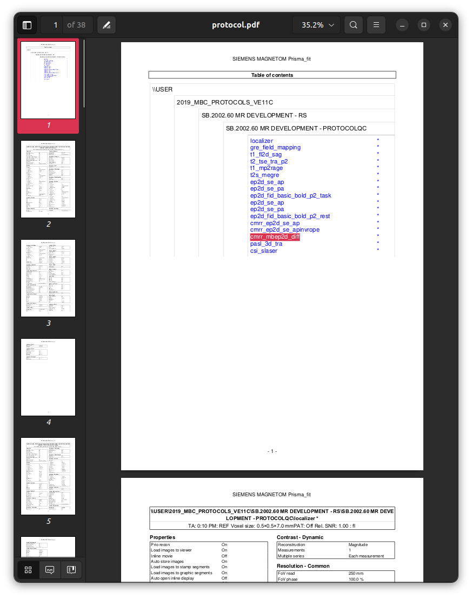
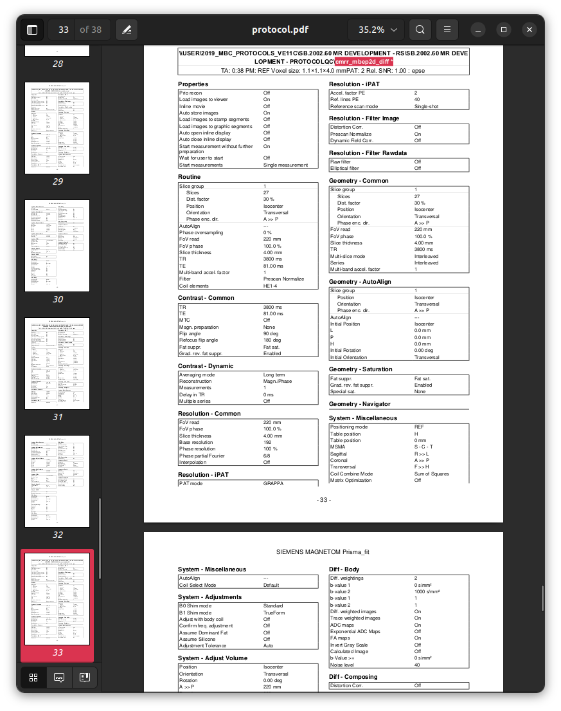
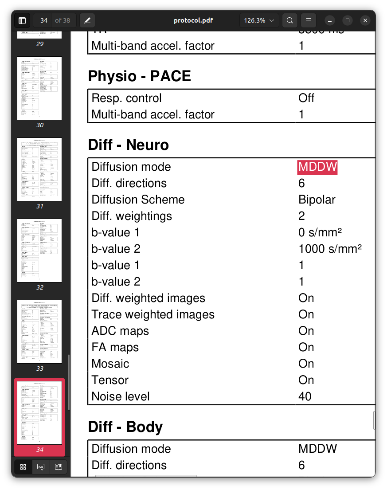
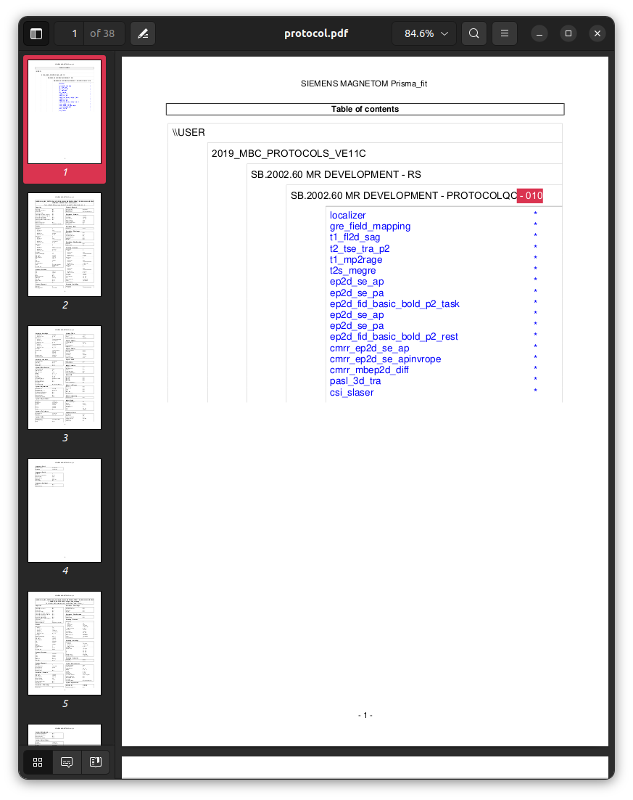
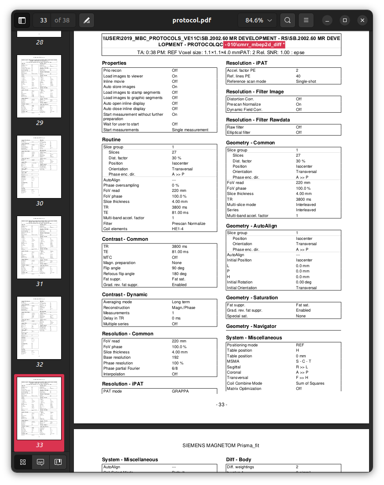
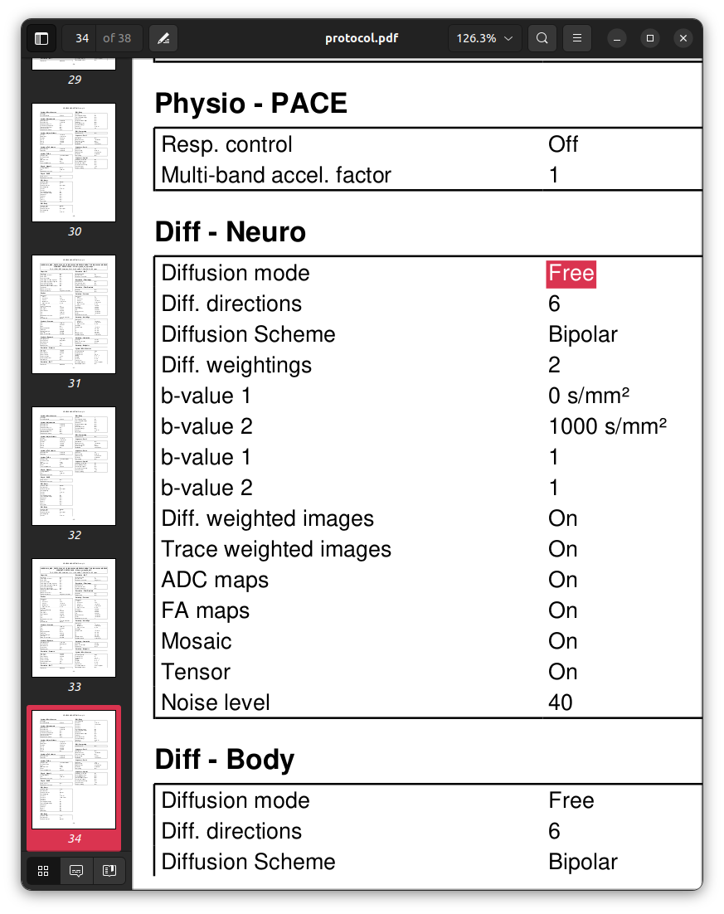

### Session 010

```text
INFO Comparing data to: 03_checkparams.json
INFO ------------------------------------------------------------------------------------------------------------------------------------------
INFO                                                        Summarising protocol matches
INFO ------------------------------------------------------------------------------------------------------------------------------------------
INFO  - 03_checkparams.json: 0.83
INFO    - one or more acquisition templates were unmatched
INFO ------------------------------------------------------------------------------------------------------------------------------------------
```

Version 3 of the protocol template
highlights that there is *some kind of* discrepancy in this session.
Here is what the log file reports:

```text
INFO ------------------------------------------------------------------------------------------------------------------------------------------
INFO                                                         Summary of series matches
INFO ------------------------------------------------------------------------------------------------------------------------------------------
INFO Template                                                     | MatchStatus  | DataSeries                          | Score  | Complete
INFO ------------------------------------------------------------------------------------------------------------------------------------------
INFO Localizer:Image                                              | MATCH        | 1:localizer                         |   1.00 | True
INFO Dual echo gradient echo field map:PhaseDiff                  | MATCH        | 2:gre_field_mapping                 |   1.00 | True
INFO T1-weighted FLASH:Image                                      | MATCH        | 3:t1_fl2d_sag                       |   1.00 | True
INFO T2-weighted Turbo Spin Echo:Image                            | MATCH        | 4:t2_tse_tra_p2                     |   1.00 | True
INFO MP2RAGE:First inversion                                      | MATCH        | 5:t1_mp2rage_INV1                   |   1.00 | True
INFO MP2RAGE:Second inversion                                     | MATCH        | 6:t1_mp2rage_INV2                   |   1.00 | True
INFO MP2RAGE:T1 map                                               | MATCH        | 7:t1_mp2rage_T1_Images              |   1.00 | True
INFO MP2RAGE:First simulated inversion time                       | MATCH        | 8:t1_mp2rage_T1_Images_SIM-TI410ms  |   1.00 | True
INFO MP2RAGE:Second simulated inversion time                      | MATCH        | 9:t1_mp2rage_T1_Images_SIM-TI1100ms |   1.00 | True
INFO MP2RAGE:Uniform intensity image                              | MATCH        | 10:t1_mp2rage_UNI_Images            |   1.00 | True
INFO MP2RAGE:Denoised uniform intensity image                     | MATCH        | 11:t1_mp2rage_UNI-DEN               |   1.00 | True
INFO T2*-weighted multi-echo gradient echo:Magnitude (original)   | MATCH        | 12:t2s_megre                        |   1.00 | True
INFO T2*-weighted multi-echo gradient echo:Magnitude (normalised) | MATCH        | 13:t2s_megre                        |   1.00 | True
INFO T2*-weighted multi-echo gradient echo:Phase                  | MATCH        | 14:t2s_megre                        |   1.00 | True
INFO T2*-weighted multi-echo gradient echo:R2* map                | MATCH        | 15:R2Star_Images                    |   1.00 | True
INFO Spin-echo EPI (product); A>>P:Image                          | DUPLICATES   | ---                                 | ---    | ---
INFO                                                              |              | 16:ep2d_se_ap                       |   1.00 | True
INFO                                                              |              | 19:ep2d_se_ap                       |   1.00 | True
INFO Spin-echo EPI (product); P>>A:Image                          | DUPLICATES   | ---                                 | ---    | ---
INFO                                                              |              | 17:ep2d_se_pa                       |   1.00 | True
INFO                                                              |              | 20:ep2d_se_pa                       |   1.00 | True
INFO Task-based fMRI BOLD:Image                                   | MATCH        | 18:ep2d_fid_basic_bold_p2_task      |   1.00 | True
INFO Resting-state fMRI BOLD:Image                                | MATCH        | 21:ep2d_fid_basic_bold_p2_rest      |   1.00 | True
INFO Spin-echo EPI (CMRR); A>>P:Image                             | MATCH        | 22:cmrr_ep2d_se_ap                  |   1.00 | True
INFO Spin-echo EPI (CMRR); A>>P Inv-RO-PE:Image                   | MATCH        | 23:cmrr_ep2d_se_apinvrope           |   1.00 | True
INFO Diffusion MRI:DWI magnitude                                  | PART. DUPES  | ---                                 | ---    | ---
INFO                                                              |              | 24:cmrr_mbep2d_diff                 |   0.97 | True
INFO                                                              |              | 25:cmrr_mbep2d_diff                 |   0.95 | True
INFO Diffusion MRI:DWI phase                                      | PART. DUPES  | ---                                 | ---    | ---
INFO                                                              |              | 24:cmrr_mbep2d_diff                 |   0.95 | True
INFO                                                              |              | 25:cmrr_mbep2d_diff                 |   0.97 | True
INFO Diffusion MRI:ADC                                            | PART. DUPES  | ---                                 | ---    | ---
INFO                                                              |              | 24:cmrr_mbep2d_diff                 |   0.89 | True
INFO                                                              |              | 25:cmrr_mbep2d_diff                 |   0.89 | True
INFO Diffusion MRI:Trace-weighted                                 | PART. DUPES  | ---                                 | ---    | ---
INFO                                                              |              | 24:cmrr_mbep2d_diff                 |   0.87 | True
INFO                                                              |              | 25:cmrr_mbep2d_diff                 |   0.87 | True
INFO Diffusion MRI:Fractional Anisotropy                          | PART. DUPES  | ---                                 | ---    | ---
INFO                                                              |              | 24:cmrr_mbep2d_diff                 |   0.90 | True
INFO                                                              |              | 25:cmrr_mbep2d_diff                 |   0.90 | True
INFO Directionally-Encoded Colour FA:Images                       | NO MATCH     |                                     |      0 |
INFO Diffusion Tensor:Data                                        | PART. DUPES  | ---                                 | ---    | ---
INFO                                                              |              | 1:localizer                         |   0.82 | True
INFO                                                              |              | 2:gre_field_mapping                 |   0.82 | True
INFO                                                              |              | 3:t1_fl2d_sag                       |   0.82 | True
INFO                                                              |              | 4:t2_tse_tra_p2                     |   0.82 | True
INFO                                                              |              | 5:t1_mp2rage_INV1                   |   0.82 | True
INFO                                                              |              | 6:t1_mp2rage_INV2                   |   0.82 | True
INFO                                                              |              | 7:t1_mp2rage_T1_Images              |   0.82 | True
INFO                                                              |              | 8:t1_mp2rage_T1_Images_SIM-TI410ms  |   0.82 | True
INFO                                                              |              | 9:t1_mp2rage_T1_Images_SIM-TI1100ms |   0.82 | True
INFO                                                              |              | 10:t1_mp2rage_UNI_Images            |   0.82 | True
INFO                                                              |              | 11:t1_mp2rage_UNI-DEN               |   0.82 | True
INFO                                                              |              | 12:t2s_megre                        |   0.82 | True
INFO                                                              |              | 13:t2s_megre                        |   0.82 | True
INFO                                                              |              | 14:t2s_megre                        |   0.82 | True
INFO                                                              |              | 15:R2Star_Images                    |   0.82 | True
INFO                                                              |              | 16:ep2d_se_ap                       |   0.82 | True
INFO                                                              |              | 17:ep2d_se_pa                       |   0.82 | True
INFO                                                              |              | 18:ep2d_fid_basic_bold_p2_task      |   0.82 | True
INFO                                                              |              | 19:ep2d_se_ap                       |   0.82 | True
INFO                                                              |              | 20:ep2d_se_pa                       |   0.82 | True
INFO                                                              |              | 21:ep2d_fid_basic_bold_p2_rest      |   0.82 | True
INFO                                                              |              | 22:cmrr_ep2d_se_ap                  |   0.82 | True
INFO                                                              |              | 23:cmrr_ep2d_se_apinvrope           |   0.82 | True
INFO                                                              |              | 24:cmrr_mbep2d_diff                 |   0.82 | True
INFO                                                              |              | 25:cmrr_mbep2d_diff                 |   0.82 | True
INFO                                                              |              | 26:pasl_3d_tra                      |   0.82 | True
INFO                                                              |              | 27:Perfusion_Weighted               |   0.82 | True
INFO                                                              |              | 28:csi_slaser                       |   0.82 | True
INFO Pulsed Arterial Spin Labelling:Images                        | MATCH        | 26:pasl_3d_tra                      |   1.00 | True
INFO Pulsed Arterial Spin Labelling:Perfusion-weighted            | MATCH        | 27:Perfusion_Weighted               |   1.00 | True
INFO Spectroscopy:Data                                            | MATCH        | 28:csi_slaser                       |   1.00 | True
INFO Phoenix Report:Data                                          | MATCH        | 99:PhoenixZIPReport                 |   1.00 | True
INFO ------------------------------------------------------------------------------------------------------------------------------------------
INFO                                                       Summary of acquisition matches
INFO ------------------------------------------------------------------------------------------------------------------------------------------
INFO Template                                 | MatchStatus                          | Score  | Complete
INFO ------------------------------------------------------------------------------------------------------------------------------------------
INFO Localizer                                | MATCH                                | 1.00   | True
INFO Dual echo gradient echo field map        | MATCH                                | 1.00   | True
INFO T1-weighted FLASH                        | MATCH                                | 1.00   | True
INFO T2-weighted Turbo Spin Echo              | MATCH                                | 1.00   | True
INFO MP2RAGE                                  | MATCH                                | 1.00   | True
INFO T2*-weighted multi-echo gradient echo    | MATCH                                | 1.00   | True
INFO Spin-echo EPI (product); A>>P            | DUPLICATES (EXPECTED)                | 1.00   | True
INFO Spin-echo EPI (product); P>>A            | DUPLICATES (EXPECTED)                | 1.00   | True
INFO Task-based fMRI BOLD                     | MATCH                                | 1.00   | True
INFO Resting-state fMRI BOLD                  | MATCH                                | 1.00   | True
INFO Spin-echo EPI (CMRR); A>>P               | MATCH                                | 1.00   | True
INFO Spin-echo EPI (CMRR); A>>P Inv-RO-PE     | MATCH                                | 1.00   | True
INFO Diffusion MRI                            | NOMATCH                              | 0.00   | True
INFO Directionally-Encoded Colour FA          | NOMATCH                              | 0.00   | True
INFO Diffusion Tensor                         | NOMATCH                              | 0.00   | True
INFO Pulsed Arterial Spin Labelling           | MATCH                                | 1.00   | True
INFO Spectroscopy                             | MATCH                                | 1.00   | True
INFO Phoenix Report                           | MATCH                                | 1.00   | True
INFO ------------------------------------------------------------------------------------------------------------------------------------------
INFO Acquisition ordering correct: not checked
INFO No check for paired fmaps requested.
INFO ------------------------------------------------------------------------------------------------------------------------------------------
INFO
INFO ------------------------------------------------------------------------------------------------------------------------------------------
INFO ------------------------------------------------------------------------------------------------------------------------------------------
```

It is clear from this output that there is some issue with the diffusion MRI acquisition;
the diagnosis is however non-specific.
On close inspection of the log file,
this is the first observation:

```text
...
INFO  Comparing series template: Diffusion MRI:DWI magnitude
...
INFO  -> to data series 24:cmrr_mbep2d_diff...
DEBUG     PRIVATE-BValue: 995 not in set ([0, 1000])
DEBUG             97.37% match
...
```

This relates to an esoteric detail of diffusion MRI acquisitions.
On Siemens scanners at least,
the diffusion sensitisation strength *b*-value reportewd in the DICOM headers
is *not* the *b*-value that is *requested* in the protocol;
rather, it is the estimated *actual* *b*-value applied during image preparation,
which is computed taking into account *all* magnetic field gradients.
Gradients such as those used for slice selection
have a non-zero diffuson sensitisation,
which when taken into account can slightly modify
both the reported diffusion sensitisation direction and strength.
Discrepancies between the protocol template and empirical data
that are within these imprecisions
should not be treated as discordance with that template.
Since Siemens scanners only report these *b*-values
with a numerical precision of 5 s/mm^2,
we can embed the permissible imprecision
into the protocol template by changing:

```json
    },
    "Series": {
      "fields": {
        "PRIVATE-BValue": {
          "value": [0, 1000],
          "comparison": "in_set"
        },
      }
    },
```

to:

```json
    },
    "Series": {
      "fields": {
        "PRIVATE-BValue": {
          "value": [0, 5, 10, 15, 985, 990, 995, 1000, 1005, 1010, 1015],
          "comparison": "in_set"
        },
      }
    },
```

Re-running ProtocolQC with this new template now yields:

```text
INFO Comparing data to: 04_additional.json
INFO ------------------------------------------------------------------------------------------------------------------------------------------
INFO                                                        Summarising protocol matches
INFO ------------------------------------------------------------------------------------------------------------------------------------------
INFO  - 04_additional.json: 1.00 (MISSING DATA)
INFO -----------------------------------------------------------------------------------------------------------------------------------------
```

```text
INFO ------------------------------------------------------------------------------------------------------------------------------------------
INFO                                                         Summary of series matches
INFO ------------------------------------------------------------------------------------------------------------------------------------------
INFO Template                                                     | MatchStatus  | DataSeries                          | Score  | Complete
INFO ------------------------------------------------------------------------------------------------------------------------------------------
INFO Localizer:Image                                              | MATCH        | 1:localizer                         |   1.00 | True
INFO Dual echo gradient echo field map:PhaseDiff                  | MATCH        | 2:gre_field_mapping                 |   1.00 | True
INFO T1-weighted FLASH:Image                                      | MATCH        | 3:t1_fl2d_sag                       |   1.00 | True
INFO T2-weighted Turbo Spin Echo:Image                            | MATCH        | 4:t2_tse_tra_p2                     |   1.00 | True
INFO MP2RAGE:First inversion                                      | MATCH        | 5:t1_mp2rage_INV1                   |   1.00 | True
INFO MP2RAGE:Second inversion                                     | MATCH        | 6:t1_mp2rage_INV2                   |   1.00 | True
INFO MP2RAGE:T1 map                                               | MATCH        | 7:t1_mp2rage_T1_Images              |   1.00 | True
INFO MP2RAGE:First simulated inversion time                       | MATCH        | 8:t1_mp2rage_T1_Images_SIM-TI410ms  |   1.00 | True
INFO MP2RAGE:Second simulated inversion time                      | MATCH        | 9:t1_mp2rage_T1_Images_SIM-TI1100ms |   1.00 | True
INFO MP2RAGE:Uniform intensity image                              | MATCH        | 10:t1_mp2rage_UNI_Images            |   1.00 | True
INFO MP2RAGE:Denoised uniform intensity image                     | MATCH        | 11:t1_mp2rage_UNI-DEN               |   1.00 | True
INFO T2*-weighted multi-echo gradient echo:Magnitude (original)   | MATCH        | 12:t2s_megre                        |   1.00 | True
INFO T2*-weighted multi-echo gradient echo:Magnitude (normalised) | MATCH        | 13:t2s_megre                        |   1.00 | True
INFO T2*-weighted multi-echo gradient echo:Phase                  | MATCH        | 14:t2s_megre                        |   1.00 | True
INFO T2*-weighted multi-echo gradient echo:R2* map                | MATCH        | 15:R2Star_Images                    |   1.00 | True
INFO Spin-echo EPI (product); A>>P:Image                          | DUPLICATES   | ---                                 | ---    | ---
INFO                                                              |              | 16:ep2d_se_ap                       |   1.00 | True
INFO                                                              |              | 19:ep2d_se_ap                       |   1.00 | True
INFO Spin-echo EPI (product); P>>A:Image                          | DUPLICATES   | ---                                 | ---    | ---
INFO                                                              |              | 17:ep2d_se_pa                       |   1.00 | True
INFO                                                              |              | 20:ep2d_se_pa                       |   1.00 | True
INFO Task-based fMRI BOLD:Image                                   | MATCH        | 18:ep2d_fid_basic_bold_p2_task      |   1.00 | True
INFO Resting-state fMRI BOLD:Image                                | MATCH        | 21:ep2d_fid_basic_bold_p2_rest      |   1.00 | True
INFO Spin-echo EPI (CMRR); A>>P:Image                             | MATCH        | 22:cmrr_ep2d_se_ap                  |   1.00 | True
INFO Spin-echo EPI (CMRR); A>>P Inv-RO-PE:Image                   | MATCH        | 23:cmrr_ep2d_se_apinvrope           |   1.00 | True
INFO Diffusion MRI:DWI magnitude                                  | MATCH        | 24:cmrr_mbep2d_diff                 |   1.00 | True
INFO Diffusion MRI:DWI phase                                      | MATCH        | 25:cmrr_mbep2d_diff                 |   1.00 | True
INFO Diffusion MRI:ADC                                            | MATCH        | 26:cmrr_mbep2d_diff_ADC             |   1.00 | True
INFO Diffusion MRI:Trace-weighted                                 | MATCH        | 27:cmrr_mbep2d_diff_TRACEW          |   1.00 | False
INFO Diffusion MRI:Fractional Anisotropy                          | MATCH        | 28:cmrr_mbep2d_diff_FA              |   1.00 | True
INFO Directionally-Encoded Colour FA:Images                       | MATCH        | 29:cmrr_mbep2d_diff_ColFA           |   1.00 | True
INFO Diffusion Tensor:Data                                        | MATCH        | 30:cmrr_mbep2d_diff_TENSOR          |   1.00 | True
INFO Pulsed Arterial Spin Labelling:Images                        | MATCH        | 31:pasl_3d_tra                      |   1.00 | True
INFO Pulsed Arterial Spin Labelling:Perfusion-weighted            | MATCH        | 32:Perfusion_Weighted               |   1.00 | True
INFO Spectroscopy:Data                                            | MATCH        | 33:csi_slaser                       |   1.00 | True
INFO Phoenix Report:Data                                          | MATCH        | 99:PhoenixZIPReport                 |   1.00 | True
INFO ------------------------------------------------------------------------------------------------------------------------------------------
INFO                                                       Summary of acquisition matches
INFO ------------------------------------------------------------------------------------------------------------------------------------------
INFO Template                                 | MatchStatus                          | Score  | Complete
INFO ------------------------------------------------------------------------------------------------------------------------------------------
INFO Localizer                                | MATCH                                | 1.00   | True
INFO Dual echo gradient echo field map        | MATCH                                | 1.00   | True
INFO T1-weighted FLASH                        | MATCH                                | 1.00   | True
INFO T2-weighted Turbo Spin Echo              | MATCH                                | 1.00   | True
INFO MP2RAGE                                  | MATCH                                | 1.00   | True
INFO T2*-weighted multi-echo gradient echo    | MATCH                                | 1.00   | True
INFO Spin-echo EPI (product); A>>P            | DUPLICATES (EXPECTED)                | 1.00   | True
INFO Spin-echo EPI (product); P>>A            | DUPLICATES (EXPECTED)                | 1.00   | True
INFO Task-based fMRI BOLD                     | MATCH                                | 1.00   | True
INFO Resting-state fMRI BOLD                  | MATCH                                | 1.00   | True
INFO Spin-echo EPI (CMRR); A>>P               | MATCH                                | 1.00   | True
INFO Spin-echo EPI (CMRR); A>>P Inv-RO-PE     | MATCH                                | 1.00   | True
INFO Diffusion MRI                            | MATCH                                | 1.00   | False
INFO Directionally-Encoded Colour FA          | MATCH                                | 1.00   | True
INFO Diffusion Tensor                         | MATCH                                | 1.00   | True
INFO Pulsed Arterial Spin Labelling           | MATCH                                | 1.00   | True
INFO Spectroscopy                             | MATCH                                | 1.00   | True
INFO Phoenix Report                           | MATCH                                | 1.00   | True
INFO ------------------------------------------------------------------------------------------------------------------------------------------
INFO Acquisition ordering correct: yes
INFO No check for paired fmaps requested.
INFO ------------------------------------------------------------------------------------------------------------------------------------------
```

The software claims that the data expected to produced
by the diffusion MRI sequence are incomplete,
specifically for the trace-weighted image data.
This is however misleading:
in actuality, there has been an *excess* of image data
produced for that image series:

```sh
ls data/Template/27_cmrr_mbep2d_diff_TRACEW/dicom_series/ | \
    wc -l
```

`27`

```sh
ls data/010/27_cmrr_mbep2d_diff_TRACEW/dicom_series/ | \
    wc -l
```

`108`

This stems from a similar effect to that previously described above,
where the achieved diffusion *b*-value
is not always precisely that prescribed.
For this particular acquisition,
the image reconstruction software has somewhat erroneously concluded
that there are four unique non-zero *b*-values in the DWI data,
and so has computed four trace-weighted image volumes.
This gives at least some clue
as to the discrepancy introduced in this imaging session,
though the ProtocolQC software is not yet capable of reporting this
with the desired specificity.
Here's the relevant detail in the protocol PDF printouts:

For the template protocol:







```sh
# Note: Reproducing this command call requires installation of the Xpdf package
pdftotext data/Template/protocol.pdf - -f 34 -l 34 -layout | \
    grep "Diffusion mode" | \
    head -n1
```

`Diffusion mode         MDDW`

And for session `010`:







```sh
# Note: Reproducing this command call requires installation of the Xpdf package
pdftotext data/010/protocol.pdf - -f 34 -l 34 -layout | \
    grep "Diffusion mode" | \
    head -n1
```

`Diffusion mode         FREE`

"MDDW" stands for "multi-directional diffusion weighting",
and refers to pre-defined sets of diffusion sensitisation directions
that are embedded within the diffusion MRI sequence code;
for each direction on the sphere that is defined within the set,
an image volume is acquired with diffusion sensitisation applied
along that specific direction.
"Free", on the other hand,
reflects the capability for the scanner user
to provide to the sequence a text file,
containing one or more user-defined sets of diffusion sensitisation directions.
While the *number* of unique diffusion sensitisation directions
is identical between these two acquisitions,
as is the nominal requested *b*-value,
the *directions* themselves differ,
shown here using the *MRtrix3* software:

```sh
mrinfo data/Template/24_cmrr_mbep2d_diff/ -dwgrad
```

```
                   0                    0                    0                    0
  -0.707823675718349 -0.00214717995667668   -0.706385895747359                 1000
   0.707823675718349 -0.00214717995667668   -0.706385895747359                 1000
 -0.0021211898478808    0.710295809061784   -0.703900109520446                 1000
 -0.0021211898478808    0.710295809061784    0.703900109520446                 1000
  -0.704621422930318     0.70956617245965 -0.00494946952888269                 1000
   0.704621422930318     0.70956617245965 -0.00494946952888269                 1000
```

```sh
mrinfo data/010/24_cmrr_mbep2d_diff/ -dwgrad
```

```
  -0.45970082562244   0.627963036699632   0.627963036699632                   5
 -0.258985030409684   0.933015905450061  -0.249816080749214                1005
  0.457772234630712  -0.113317806195457   0.881818380393748                 995
  0.625529848323101   0.732933721469189   0.267433297833691                1005
   0.97600055036663  -0.216499060081327 -0.0234751500088183                1000
 -0.303524167363553   0.601493354775357   0.738971463581205                1000
 -0.530496099414573  -0.432834583204241   0.728853971717473                1000
```

The ProtocolQC tool is not yet capable
of *directly* detecting and reporting such discrepancies: #6
