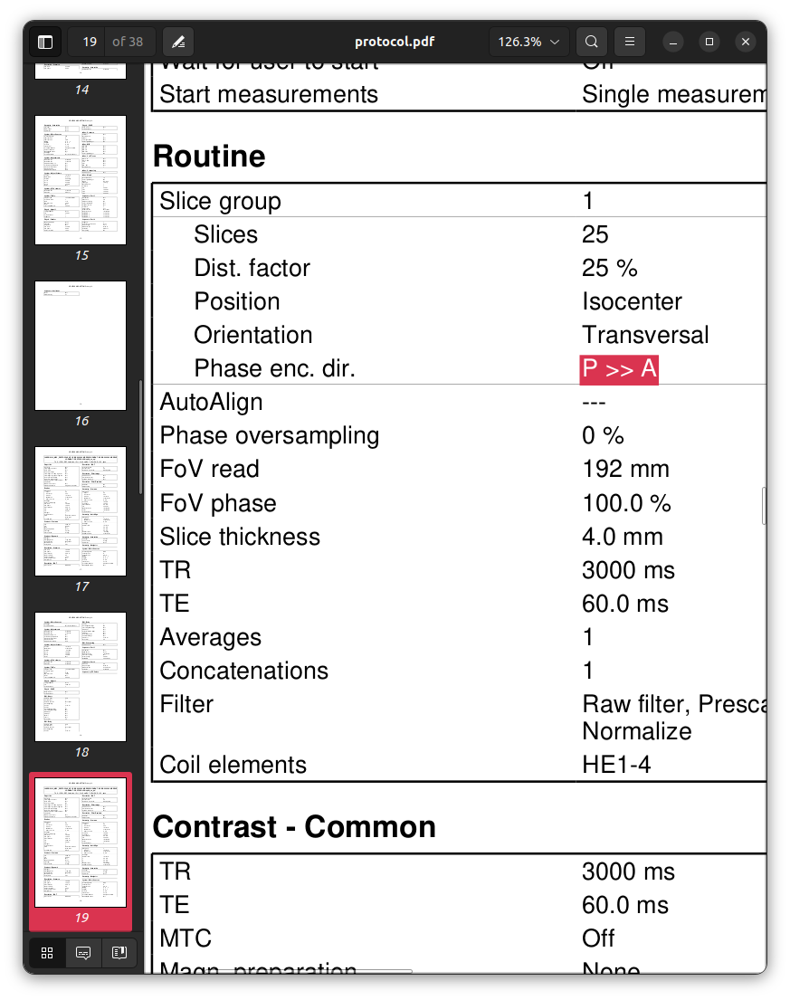

### Session 011

```text
INFO ------------------------------------------------------------------------------------------------------------------------------------------
INFO                                                        Summarising protocol matches
INFO ------------------------------------------------------------------------------------------------------------------------------------------
INFO  - 04_additional.json: 1.00
INFO ------------------------------------------------------------------------------------------------------------------------------------------
```

The software finds no issue with the data from this session.
This is however a *false negative*.
The discrepancy lies in the spin-echo EPI images
that precede the BOLD fMRI sequences
for the purpose of susceptibility field estimation.
Look closely at the content of the "Geometry - Common" section
of the protocol PDF printouts
between the acquisition used to build the protocol template
and the data from session `011`.

First, the template session:


 


 

```sh
pdftotext data/Template/protocol.pdf - -f 17 -l 17 -layout | \
    grep "Phase enc\. dir\." | \
    head -n1 | \
    sed 's/  */ /g'
```

`Phase enc. dir. A >> P`

```sh
pdftotext data/Template/protocol.pdf - -f 19 -l 19 -layout | \
    grep "Phase enc\. dir\." | \
    head -n1 | \
    sed 's/  */ /g'
```

`Phase enc. dir. P >> A`

This difference in phase encoding direction
results in the geometric distortions arising from field inhomogeneities
manifesting in *opposite directions* between the two images.

The effect is more subtle in the phantom scanned for the purpose of this tutorial
in comparison to human data,
where a change in phase encoding direction is typically very obvious.
The following call to *MRtrix3*'s `mrview` highlights the difference:

```sh
mrview \
    -load data/Template/16_ep2d_se_ap/ \
    -intensity_range 0,1500 \
    -load /data/Template/17_ep2d_se_pa/ \
    -intensity_range 0,1500 \
    -voxel 62,22,20
```

 

Now, session `011`:


 


 

```sh
pdftotext data/011/protocol.pdf - -f 17 -l 17 -layout | \
    grep "Phase enc\. dir\." | \
    head -n1 | \
    sed 's/  */ /g'
```

`Phase enc. dir. A >> P`

```
pdftotext data/011/protocol.pdf - -f 19 -l 19 -layout | \
    grep "Phase enc\. dir\." | \
    head -n1 | \
    sed 's/  */ /g'
```

`Phase enc. dir. A >> P`

```sh
mrview \
    -load data/010/16_ep2d_se_ap/ \
    -intensity_range 0,1500 \
    -load /data/010/17_ep2d_se_pa/ \
    -intensity_range 0,1500 \
    -voxel 62,22,20
```

 

In the original protocol plan,
this pair of sequences execute with *opposite phase encoding directions*:
the first sequence specifies "`A >> P`",
while the second specifies "`P >> A`".
This phase encoding reversal is *intrinsic to the purpose* of these data:
it is the differential manifestation of susceptibility-induced geometric distortions
between these image pair
that have otherwise identical acquisition parameters
that facilitates the estimation of the inhomogeneity field that leads to those distortions
as well as the underlying undistorted image.
As such,
by erroneously acquiring these two sequences with *the same* phase encoding direction,
they *no longer serve this purpose*.
Detection of this fault is not currently possible with the software,
but should be made possible with future augmentations to the software.

**NOTE**: Software currently unable to detect this fault.
