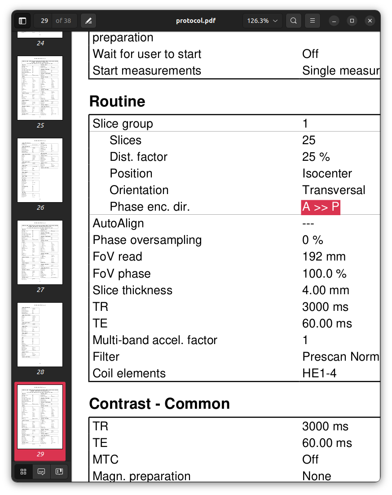

### Session `012`

```text
INFO Comparing data to: 04_additional.json
INFO ------------------------------------------------------------------------------------------------------------------------------------------
INFO                                                        Summarising protocol matches
INFO ------------------------------------------------------------------------------------------------------------------------------------------
INFO  - 04_additional.json: 1.00
INFO ------------------------------------------------------------------------------------------------------------------------------------------
```

The software initially does not detect any fault in this acquisiiton.
Similarly to session `011`,
this is also a *false positive*
relating to the reversal of phase encoding directions.
Here the fault lies not in the spin-echo EPIs
preceding the BOLD fMRI sequences,
but in the spin-echo EPIs that precede the diffusion MRI sequence,
and it has manifested in a different way.
These two images are acquired using the CMRR multi-band EPI sequence
rather than the Siemens product EPI sequence.
There is a very specific functionality within that sequence
that is utilised within this session protocol.
Let's look again closely at the PDF protocol printouts.

Firstly, the template protocol:


```sh
# Note: Reproducing this command call requires installation of the Xpdf package
pdftotext data/Template/protocol.pdf - -f 29 -l 29 -layout | \
    grep "Phase enc\. dir\." | \
    head -n1 | \
    sed 's/  */ /g'
```

`Phase enc. dir. A >> P`

```sh
# Note: Reproducing this command call requires installation of the Xpdf package
pdftotext data/Template/protocol.pdf - -f 30 -l 30 -layout | \
    grep "Invert RO\/PE polarity" | \
    sed 's/  */ /g' | \
    rev | \
    cut -d' ' -f1 | \
    rev
```

`Invert RO/PE polarity Off`

```sh
# Note: Reproducing this command call requires installation of the Xpdf package
pdftotext data/Template/protocol.pdf - -f 31 -l 31 -layout | \
    grep "Phase enc\. dir\." | \
    head -n1 | \
    sed 's/  */ /g'
```

`Phase enc. dir. A >> P`

```sh
# Note: Reproducing this command call requires installation of the Xpdf package
pdftotext data/Template/protocol.pdf - -f 32 -l 32 -layout | \
    grep "Invert RO\/PE polarity" | \
    sed 's/  */ /g' | \
    rev | \
    cut -d' ' -f1-4 | \
    rev
```

`Invert RO/PE polarity On`

The commands used above to extract the relevant information are not very clear;
this is more clearly investigated looking at the protocol printouts themselves.

With this pair of sequences,
which are intended to be acquired with opposing phase encoding directions,
*both* sequences report within the "standard" sequence parameters
that a phase encoding direction of "A >> P" was used,
which would seem to contradict the intent of the protocol design.
Specifically the CMRR multi-band EPI sequence
however has an additional feature
that is shown within the "Sequence - Special" section of the printout.
Parameter "Invert RO/PE polarity" reverses the polarity
of readout and phase encoding gradients.
This *achieves the same outcome*
as does switching the phase encoding direction between A >> P and P >> A
in the Siemens product spin-echo EPI sequence.
Implementation of this functionality within a locked sequence setting
to which the Siemens software should not apply automated changes
attempts to prevent the accidental acquisition of both sequences
with the same phase encoding direction
as exemplified in session `010`.

There is however a hidden danger in this process.
If, for the second of the two sequences in the pair,
*both* the phase encoding direction is set to "P >> A" rather than "A >> P"
*and* the "Invert RO/PE polarity" parameter is set to On,
then this will result in a *double reversal* of the phase encoding direction,
such that the resulting phase encoding direction of the second sequence
is identical to that of the first,
and therefore the image pair cannot be used
for susceptibility field estimation.

The `SeriesDescription` of the second sequence
is written in such a way to attempt to mitigate the risk of this occurring.
If the description of that sequence were to indicate
that the resulting phase encoding direction is posterior-anterior,
then the individual responsible for executing the session protocol
may see that the protocol card indicates a phase encoding direction of "A >> P",
modify that setting to "P >> A" to conform to the description of the sequence
believing that they are correcting a problem with the session protocol,
yielding an actual phase encoding direction of "A >> P" for the second sequence
due to use of the "Invert RO/PE polarity" setting.
It is for this reason that the `SeriesDescription` of the second sequence
is written as "`_apinvrope`":
this conveys that the protocol card should indicate "A >> P",
but that the "Invert RO/PE polarity" setting should be On.

Session `012` represents the erroneous scenario described above,
where for the second of this sequence pair,
the phase encoding direction has been set to "P >> A"
*and* the "Invert RO/PE polarity" parameter has been set to On:





```sh
pdftotext data/012/protocol.pdf - -f 29 -l 29 -layout | \
    grep "Phase enc\. dir\." | \
    head -n1 | \
    sed 's/  */ /g'
```

`Phase enc. dir. A >> P`

```sh
pdftotext data/012/protocol.pdf - -f 30 -l 30 -layout | \
    grep "Invert RO\/PE polarity" | \
    sed 's/  */ /g' | \
    rev | \
    cut -d' ' -f1 | \
    rev
```

`Invert RO/PE Polarity Off`

```sh
pdftotext data/012/protocol.pdf - -f 31 -l 31 -layout | \
    grep "Phase enc\. dir\." | \
    head -n1 | \
    sed 's/  */ /g'
```

`Phase enc. dir. P >> A`

```
pdftotext data/012/protocol.pdf - -f 32 -l 32 -layout | \
    grep "Invert RO\/PE polarity" | \
    sed 's/  */ /g' | \
    rev | \
    cut -d' ' -f1-4 | \
    rev
```

`Invert RO/PE Polarity On`

**NOTE**: The ProtocolQC software is currently incapable of detecting this fault.
