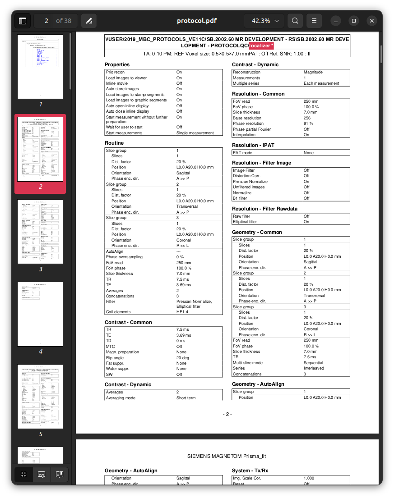

### Session `015`

```text
INFO Comparing data to: 03_checkparams.json
INFO ------------------------------------------------------------------------------------------------------------------------------------------
INFO                                                        Summarising protocol matches
INFO ------------------------------------------------------------------------------------------------------------------------------------------
INFO ------------------------------------------------------------------------------------------------------------------------------------------
INFO  - 1 protocol template matches not shown due to match score less than 0.8
INFO ------------------------------------------------------------------------------------------------------------------------------------------
```

This session is initially shown
as having an inadequate quality of matching to the template
to even warrant presentation of that matching score.

**NOTE**: The software behaviour may in the future
be changed in this respect: #27

The full log file is currently *not produded* in this instance,
which unfortunately obscures the nature of the mismatch.
What occurred in the acquisition of this particular session
is that the *incorrect head coil* was installed.

Here is the relevant information from the template protocol:





```sh
pdftotext data/Template/protocol.pdf - -f 2 -l 2 -layout | \
    grep "Coil elements" | \
    sed 's/  */ /g' | \
    cut -d' ' -f1-3
```

`Coil elements HE1-4`

Whereas for session 015:


```sh
pdftotext data/015/protocol.pdf - -f 2 -l 2 -layout | \
    grep "Coil elements" | \
    sed 's/  */ /g' | \
    cut -d' ' -f1-3
```

`Coil elements HEA;HEP`

Because the content of this field does not match the template
in *every single* image series,
the software considers the data from this imaging session
to have no concordance with the nominated template.

**NOTE**: Future versions of the software may change
how such differences are reported: #27
